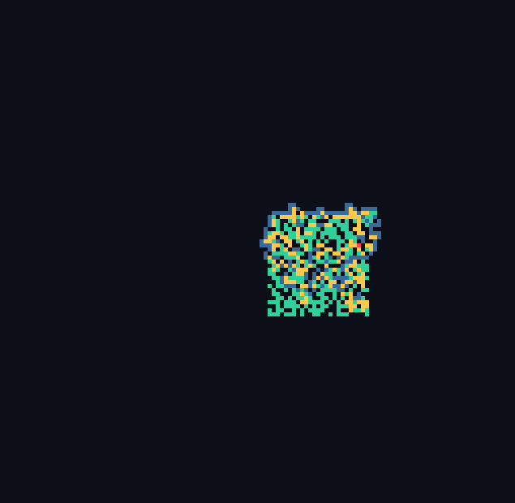
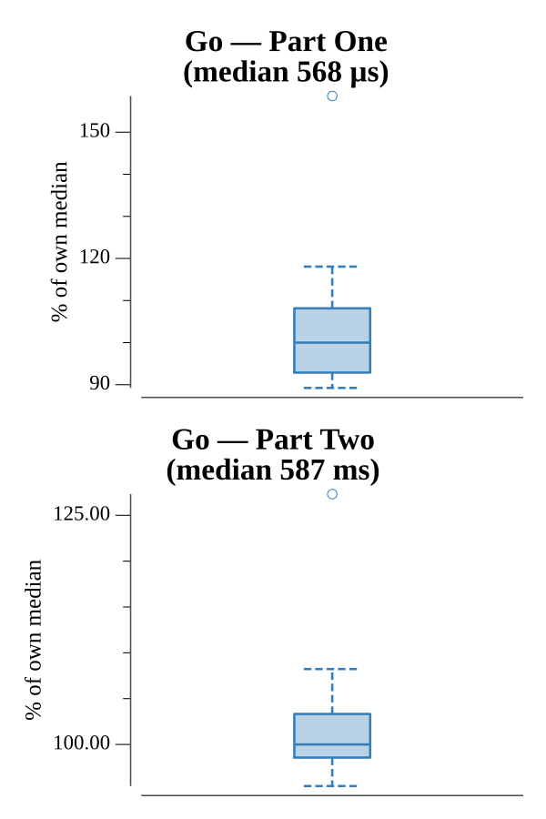

# [Day 22: Sporifica Virus](https://adventofcode.com/2017/day/22)

<!-- These are helper text to make formatting the yearly readme consistent and easier...

[Day 22: Sporifica Virus][rm22]
[Go][go22]

[rm22]: 22-sporificaVirus/README.md
[go22]: 22-sporificaVirus/go

-->

## Go

```text
────────────────────────────────────────
─     2017 Day 22: Sporifica Virus     ─
────────────────────────────────────────
Solving (Go)…
1.0:  PASS             0.585ms
2.0:  PASS           665.004ms
```

## Visualization

The four-state virus spreading across the grid (GIF), snapshotted over the first
400 000 bursts. Each node is coloured by state — weakened (blue), infected
(teal), flagged (gold) — over clean space, and the carrier is the red cell. The
colony blooms outward from the centre with the jagged, organic frontier
characteristic of this cellular automaton.



## Run Times


