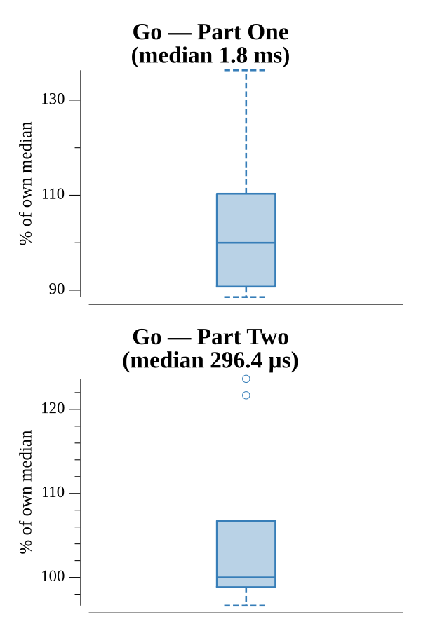

# [Day 23: Coprocessor Conflagration](https://adventofcode.com/2017/day/23)

<!-- These are helper text to make formatting the yearly readme consistent and easier...

[Day 23: Coprocessor Conflagration][rm23]
[Go][go23]

[rm23]: 23-coprocessorConflagration/README.md
[go23]: 23-coprocessorConflagration/go

-->

## Go

```text
────────────────────────────────────────
─2017 Day 23: Coprocessor Conflagration─
────────────────────────────────────────
Solving (Go)…
1.0:  PASS             1.888ms
2.0:  PASS             0.302ms
```

## Run Times


