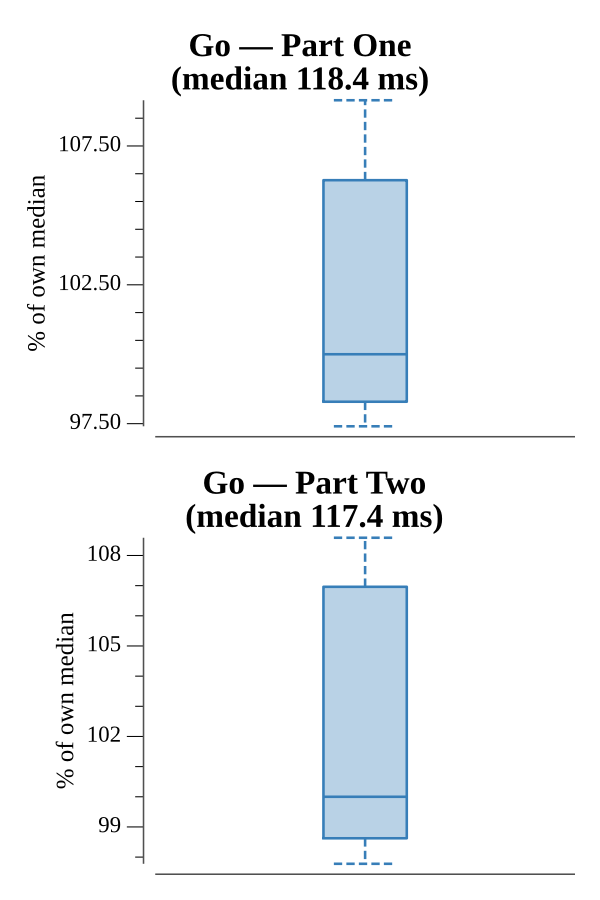

# [Day 24: Electromagnetic Moat](https://adventofcode.com/2017/day/24)

<!-- These are helper text to make formatting the yearly readme consistent and easier...

[Day 24: Electromagnetic Moat][rm24]
[Go][go24]

[rm24]: 24-electromagneticMoat/README.md
[go24]: 24-electromagneticMoat/go

-->

## Go

```text
────────────────────────────────────────
─  2017 Day 24: Electromagnetic Moat   ─
────────────────────────────────────────
Solving (Go)…
1.0:  PASS           117.912ms
2.0:  PASS           117.703ms
```

## Run Times


