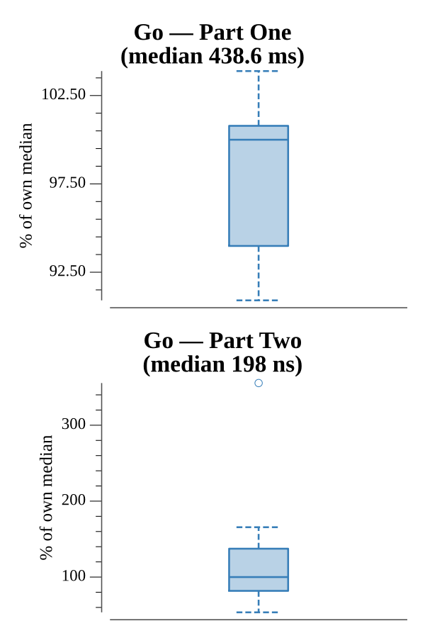

# [Day 25: The Halting Problem](https://adventofcode.com/2017/day/25)

<!-- These are helper text to make formatting the yearly readme consistent and easier...

[Day 25: The Halting Problem][rm25]
[Go][go25]

[rm25]: 25-theHaltingProblem/README.md
[go25]: 25-theHaltingProblem/go

-->

## Go

```text
────────────────────────────────────────
─   2017 Day 25: The Halting Problem   ─
────────────────────────────────────────
Solving (Go)…
1.0:  PASS           461.457ms
2.0:  NEW              0.000ms
      Merry Christmas!
```

## Run Times


