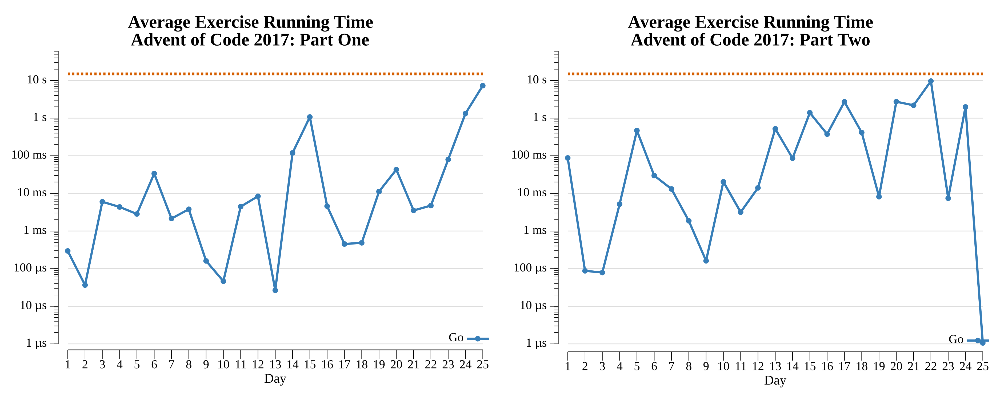

# Advent of Code: 2017

[Advent of Code 2017](https://adventofcode.com/2017) exercise solutions.

<!-- ★ ☆ -->

| Exercise                                              | Stars | Solutions                   |
|-------------------------------------------------------|:-----:|-----------------------------|
| [Day 1: Inverse Captcha](01-inverseCaptcha/README.md) |  ★ ★  | [Go](01-inverseCaptcha/go) |
| [Day 2: Corruption Checksum](02-corruptionChecksum/README.md) |  ★ ★  | [Go](02-corruptionChecksum/go) |
| [Day 3: Spiral Memory](03-spiralMemory/README.md) |  ★ ★  | [Go](03-spiralMemory/go) |
| [Day 4: High-Entropy Passphrases](04-high-EntropyPassphrases/README.md) |  ★ ★  | [Go](04-high-EntropyPassphrases/go) |
| [Day 5: A Maze of Twisty Trampolines, All Alike](05-aMazeOfTwistyTrampolinesAllAlike/README.md) |  ★ ★  | [Go](05-aMazeOfTwistyTrampolinesAllAlike/go) |
| [Day 6: Memory Reallocation](06-memoryReallocation/README.md) |  ★ ★  | [Go](06-memoryReallocation/go) |
| [Day 7: Recursive Circus](07-recursiveCircus/README.md) |  ★ ★  | [Go](07-recursiveCircus/go) |
| [Day 8: I Heard You Like Registers](08-iHeardYouLikeRegisters/README.md) |  ★ ★  | [Go](08-iHeardYouLikeRegisters/go) |
| [Day 9: Stream Processing](09-streamProcessing/README.md) |  ★ ★  | [Go](09-streamProcessing/go) |
| [Day 10: Knot Hash](10-knotHash/README.md) |  ★ ★  | [Go](10-knotHash/go) |
| [Day 11: Hex Ed](11-hexEd/README.md) |  ★ ★  | [Go](11-hexEd/go) |
| [Day 12: Digital Plumber](12-digitalPlumber/README.md) |  ★ ★  | [Go](12-digitalPlumber/go) |
| [Day 13: Packet Scanners](13-packetScanners/README.md) |  ★ ★  | [Go](13-packetScanners/go) |
| [Day 14: Disk Defragmentation](14-diskDefragmentation/README.md) |  ★ ★  | [Go](14-diskDefragmentation/go) |
| [Day 15: Dueling Generators](15-duelingGenerators/README.md) |  ★ ★  | [Go](15-duelingGenerators/go) |
| [Day 16: Permutation Promenade](16-permutationPromenade/README.md) |  ★ ★  | [Go](16-permutationPromenade/go) |
| [Day 17: Spinlock](17-spinlock/README.md) |  ★ ★  | [Go](17-spinlock/go) |
| [Day 18: Duet](18-duet/README.md) |  ★ ★  | [Go](18-duet/go) |
| [Day 19: A Series of Tubes](19-aSeriesOfTubes/README.md) |  ★ ★  | [Go](19-aSeriesOfTubes/go) |
| 20                                                    |  ☆ ☆  |                             |
| 21                                                    |  ☆ ☆  |                             |
| 22                                                    |  ☆ ☆  |                             |
| 23                                                    |  ☆ ☆  |                             |
| 24                                                    |  ☆ ☆  |                             |
| 25                                                    |  ☆ ☆  |                             |

## 2017 Run Times



## 2017 Personal Leaderboard

```text
      --------Part 1--------   --------Part 2--------
Day       Time   Rank  Score       Time   Rank  Score
  1       >24h  62414      0       >24h  52206      0
```
