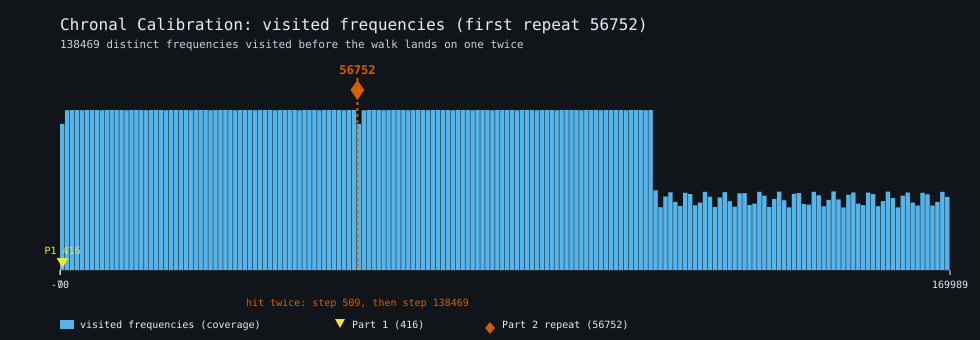
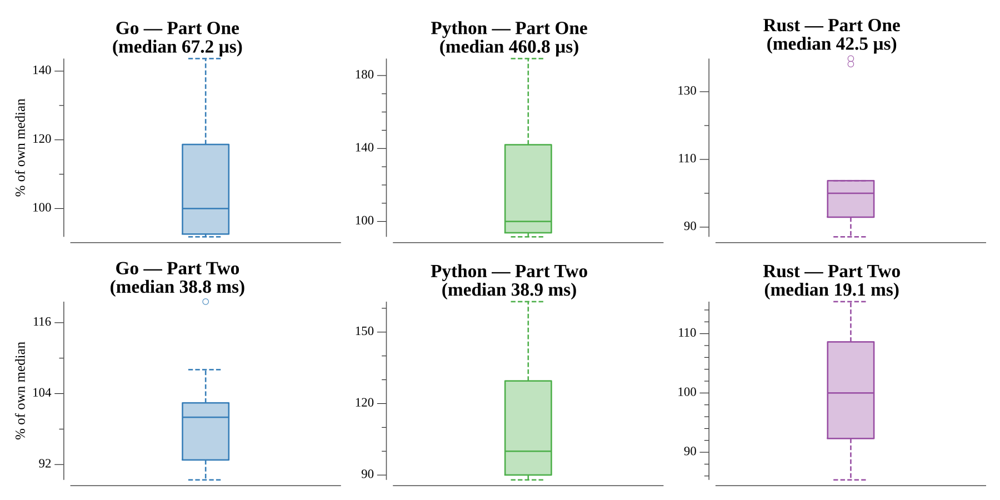

# [Day 1: Chronal Calibration](https://adventofcode.com/2018/day/1)

<!-- [Day 1: Chronal Calibration](01-chronalCalibration) -->

## Notes

The device starts at frequency 0 and applies a list of signed changes.

Part One is just the sum of every change. Part Two cycles through the list
repeatedly, tracking every intermediate frequency in a set, and returns the first
frequency reached twice. Because the list may need many passes before a repeat
appears, the seen-set is the key: it turns an otherwise unbounded search into an
O(reached) lookup, and the loop terminates the moment a duplicate is hit.

## Go

```text
────────────────────────────────────────
─   2018 Day 1: Chronal Calibration    ─
────────────────────────────────────────

Solving (Go)…
1.0:  PASS             0.074ms
2.0:  PASS            22.611ms
```

## Python

```text
    < section intentionally left blank >
```

## Visualization

The space of frequencies the walk visits, as a coverage histogram along a number
line. Each bar counts distinct frequencies visited in that band, so the near-solid
region shows where the walk spends most of its time and the sparse right tail is
the range only reached in later passes. The one value hit twice — the Part Two
answer, 56752 — is marked with a tall pointer and its two step numbers (509, then
138469, about 137 passes later). Part One (416) sits near the left. Roles are
distinguished by marker shape and position, so the chart reads in grayscale.



## Run Times


