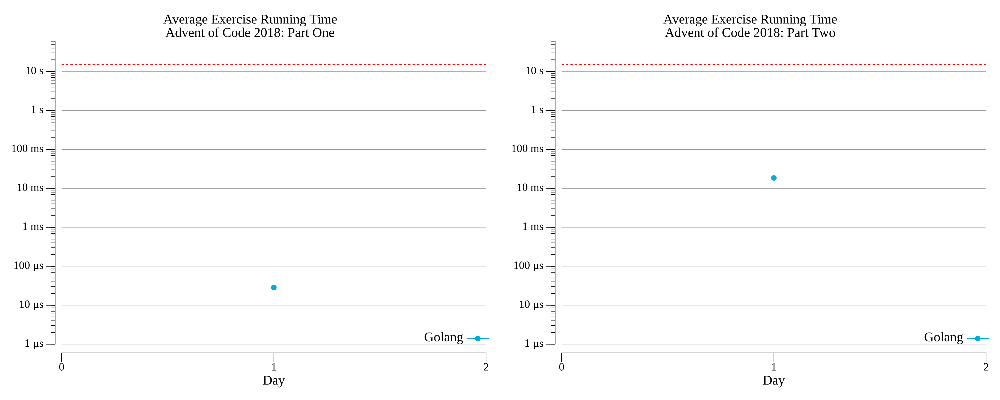

# [Day 1: Chronal Calibration](https://adventofcode.com/2018/day/1)

<!-- [Day 1: Chronal Calibration](01-chronalCalibration) -->

## Go

```text
2018-1 Chronal Calibration (Golang)

Running...

Test 1.0: pass in 1.6 µs
Test 1.1: pass in 2.7 µs
Test 1.2: pass in 2.3 µs
Test 1.3: pass in 2.1 µs
Test 2.0: pass in 2.5 µs
Test 2.1: pass in 3 µs
Test 2.2: pass in 9.3 µs
Test 2.3: pass in 4.2 µs
Part 1: 416 in 21.7 µs
Part 2: 56752 in 27.0396 ms
```

## Python

```text
    < section intentionally left blank >
```

## 2018 Run Times


