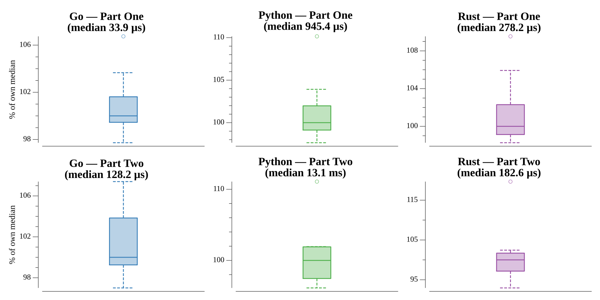

# [Day 2: Inventory Management System](https://adventofcode.com/2018/day/2)

<!-- These are helper text to make formatting the yearly readme consistent and easier...

[Day 2: Inventory Management System][rm2]
[Go][go2]
[Rust][rs2]
[Python][py2]

[rm2]: 02-inventoryManagementSystem/README.md
[go2]: 02-inventoryManagementSystem/go
[rs2]: 02-inventoryManagementSystem/rs
[py2]: 02-inventoryManagementSystem/py

-->

## Notes

The box IDs are strings of lowercase letters.

Part One is a checksum: count the IDs that contain some letter exactly twice, and
those that contain some letter exactly three times, then multiply the two counts.
A fixed `[26]int` tally per ID is enough — scan for a count of 2 and a count of 3.

Part Two finds the two correct boxes, whose IDs differ by a single character at
the same position, and returns their common letters. A pairwise scan compares
each pair character by character, bailing as soon as a second mismatch appears;
the one pair with exactly one difference yields the answer by dropping that index.

## Go

```text
────────────────────────────────────────
─   2018 Day 2: Inventory Management   ─
─                System                ─
────────────────────────────────────────

Solving (Go)…
1.0:  PASS            36.993µs
2.0:  PASS           109.755µs
```

## Rust

Both parts lean on iterator adapters. Part One folds the IDs into a `(twos, threes)`
pair, tallying each ID's letters in a `HashMap<u8, usize>` over its bytes and asking
`values().any(|c| c == n)`. Part Two works on `&[u8]` slices: for each pair it zips
the two bytes, filters the differing positions, and accepts the pair when exactly one
mismatch exists, collecting the surviving bytes into the answer `String`.

```text
────────────────────────────────────────
─   2018 Day 2: Inventory Management   ─
─                System                ─
────────────────────────────────────────

Solving (Rust)…
1.0:  PASS           175.040µs
2.0:  PASS           110.635µs
```

## Python

Part One is a comprehension of `Counter(box_id).values()` per ID, counting how many
contain a `2` or a `3`. Part Two uses `itertools.combinations` to walk each pair,
keeps the characters that match position-wise via a `zip` comprehension, and returns
their join when exactly one character was dropped.

```text
────────────────────────────────────────
─   2018 Day 2: Inventory Management   ─
─                System                ─
────────────────────────────────────────

Solving (Python)…
1.0:  PASS             0.888ms
2.0:  PASS            10.708ms
```

## Run Times


