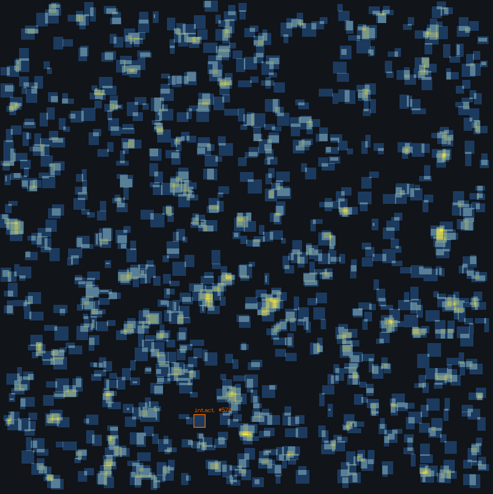
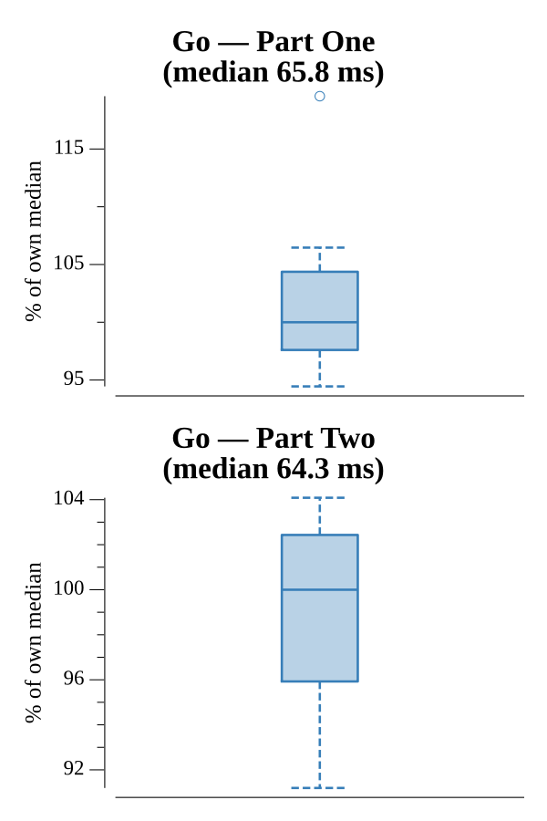

# [Day 3: No Matter How You Slice It](https://adventofcode.com/2018/day/3)

<!-- [Day 3: No Matter How You Slice It](03-noMatterHowYouSliceIt) -->

## Notes

Each claim is a rectangle on a shared piece of fabric, given as
`#id @ left,top: widthxheight`. Marking every cell each claim covers in a
coverage map answers both parts:

- **Part One** counts the cells covered by two or more claims — the contested
  fabric.
- **Part Two** finds the single claim whose every cell is covered exactly once,
  and returns its id — the one intact claim.

The claims are parsed by scanning the five integers on each line, which is robust
to whitespace and delivery quirks in the input.

## Go

```text
────────────────────────────────────────
─2018 Day 3: No Matter How You Slice It─
────────────────────────────────────────

Solving (Go)…
1.0:  PASS            65.918ms
2.0:  PASS            63.028ms
```

## Python

```text
    < section intentionally left blank >
```

## Visualization

The fabric as a heatmap: each cell is shaded by how many claims cover it, so
uncontested single-claim fabric is dim and the contested overlaps (the Part One
answer) stand out brightly. The one intact claim (the Part Two answer) is framed
and labeled. Coverage is carried by brightness and the answer by an outline and
label, so the image reads in grayscale.



## Run Times


