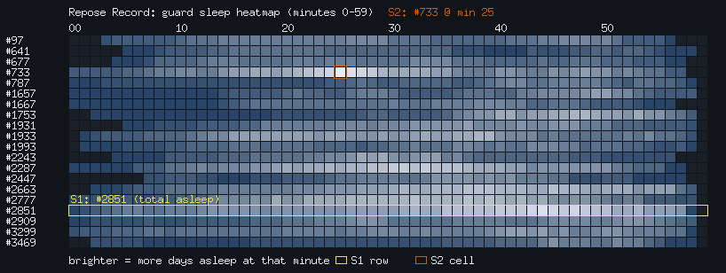
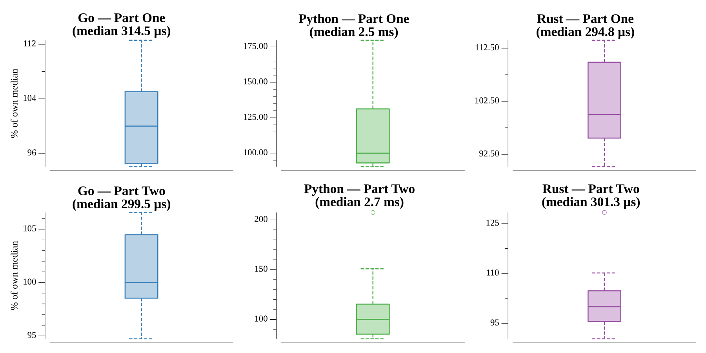

# [Day 4: Repose Record](https://adventofcode.com/2018/day/4)

<!-- These are helper text to make formatting the yearly readme consistent and easier...

[Day 4: Repose Record][rm4]
[Go][go4]
[Rust][rs4]
[Python][py4]

[rm4]: 04-reposeRecord/README.md
[go4]: 04-reposeRecord/go
[rs4]: 04-reposeRecord/rs
[py4]: 04-reposeRecord/py

-->

## Notes

The log lines arrive shuffled, but the `[YYYY-MM-DD HH:MM]` timestamp sorts
correctly as plain text, so sorting the lines lexically restores chronological
order. Walking the sorted log, a `Guard #N begins shift` line sets the active
guard and each `falls asleep` / `wakes up` pair brackets a run of asleep minutes.
Only the minute field (0–59) matters, so the whole record collapses to a tally
`asleep[guard][minute]` = number of days that guard was asleep at that minute.

- **Part One (Strategy 1):** pick the guard with the most total asleep minutes,
  then the minute they were asleep most often; answer is guard × minute.
- **Part Two (Strategy 2):** pick the single (guard, minute) cell with the
  highest count across every guard; answer is guard × minute.

## Go

```text
────────────────────────────────────────
─      2018 Day 4: Repose Record       ─
────────────────────────────────────────

Solving (Go)…
1.0:  PASS           193.115µs
2.0:  PASS           167.753µs
```

## Rust

The tally is a `HashMap<u32, [u32; 60]>`; sorting the line slice with
`sort_unstable` restores chronological order. Both strategies fall out of iterator
adapters — `max_by_key` over total sleep for Part One, and a `flat_map` that
flattens every `(guard, minute, count)` cell before a single `max_by_key` for
Part Two.

```text
────────────────────────────────────────
─      2018 Day 4: Repose Record       ─
────────────────────────────────────────

Solving (Rust)…
1.0:  PASS           253.309µs
2.0:  PASS           248.183µs
```

## Python

A `defaultdict(Counter)` keyed by guard tallies asleep minutes, updated straight
from `Counter.update(range(start, minute))`. `sorted` restores order, a regex pulls
the guard id, and the two strategies are `max` calls with a `key` — total minutes
for Part One, then `Counter.most_common` gives the peak minute per guard for both.

```text
────────────────────────────────────────
─      2018 Day 4: Repose Record       ─
────────────────────────────────────────

Solving (Python)…
1.0:  PASS             2.419ms
2.0:  PASS             2.439ms
```

## Visualization

A heatmap of the sleep tally: one row per guard, columns for minutes 0–59, each
cell shaded by how many days that guard was asleep at that minute. Strategy 1's
guard (brightest row overall) and Strategy 2's cell (the single brightest cell)
are outlined and labeled. Counts read as brightness and the two answers by
outline and label, so the heatmap reads in grayscale.



## Run Times


