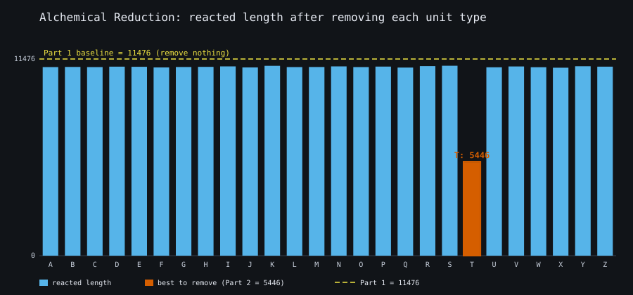
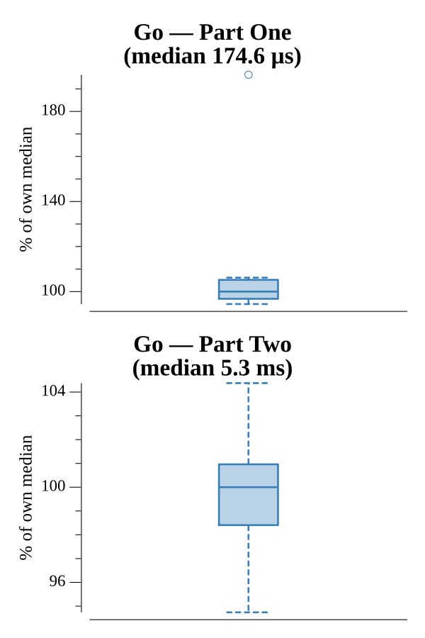

# [Day 5: Alchemical Reduction](https://adventofcode.com/2018/day/5)

<!-- [Day 5: Alchemical Reduction](05-alchemicalReduction) -->

## Notes

The polymer is a string of units where a lowercase and uppercase of the same
letter are opposite polarities. Adjacent opposite-polarity units of the same
letter react and vanish, and each removal can expose a new reacting pair, so the
collapse cascades.

A stack captures the cascade in one O(n) pass: push each unit, but if it is the
opposite-case twin of the current top, pop instead. Two ASCII letters react
exactly when they differ only in the case bit, i.e. `x ^ y == 0x20`.

- **Part One** fully reacts the polymer and reports the remaining length.
- **Part Two** removes all instances of one unit type (both cases), reacts the
  rest, and takes the minimum over all 26 letters. The same stack pass gains a
  `skip` letter so no strings are rebuilt.

## Go

```text
────────────────────────────────────────
─   2018 Day 5: Alchemical Reduction   ─
────────────────────────────────────────

Solving (Go)…
1.0:  PASS             0.274ms
2.0:  PASS             8.007ms
```

## Python

```text
    < section intentionally left blank >
```

## Visualization

The reacted length after removing each unit type A–Z, as a bar chart. The
dashed baseline is Part One (remove nothing); every bar shows how much removing
that one letter helps, and the shortest bar — the best letter to remove, the Part
Two answer — is highlighted and labeled. Lengths read as bar height and the
answer by its outline and label, so the chart reads in grayscale.



## Run Times


