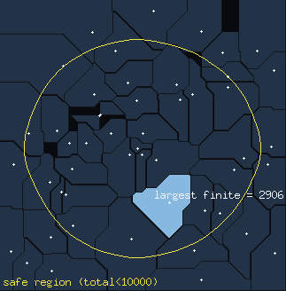
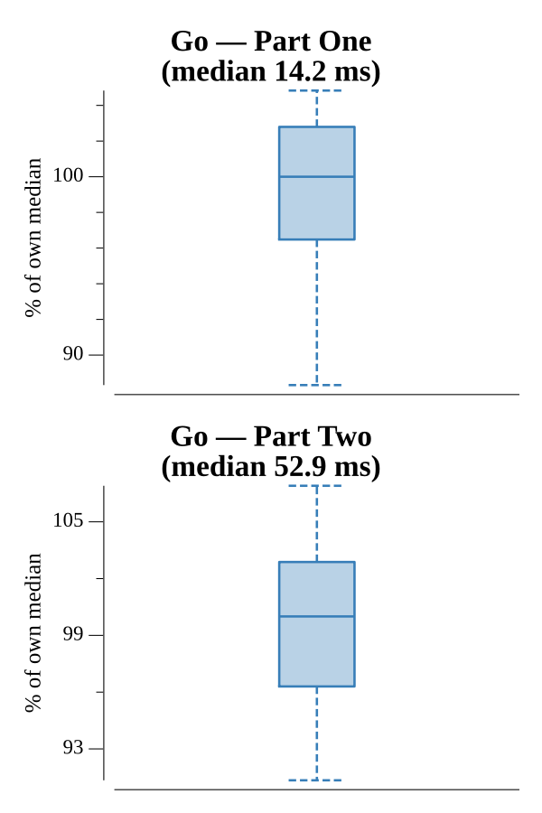

# [Day 6: Chronal Coordinates](https://adventofcode.com/2018/day/6)

<!-- [Day 6: Chronal Coordinates](06-chronalCoordinates) -->

## Notes

The coordinates seed a Manhattan-distance Voronoi diagram on the grid.

- **Part One** assigns each cell in the bounding box to its single nearest
  coordinate (ties leave the cell unowned) and reports the largest *finite* area.
  Any coordinate that owns a cell on the bounding-box edge owns an unbounded
  region — it keeps winning outward forever — so those coordinates are excluded
  from the contest.
- **Part Two** counts the cells whose *summed* distance to every coordinate is
  below a threshold (10000 for the puzzle, 32 for the worked example). Stepping
  one cell outside the box adds at least one distance per coordinate, so the
  region reaches at most `threshold / numCoords` cells beyond the box; scanning
  that padded box captures all of it.

The example's threshold differs from the real run, so the threshold is chosen
from the coordinate count rather than hardcoded.

## Go

```text
────────────────────────────────────────
─   2018 Day 6: Chronal Coordinates    ─
────────────────────────────────────────

Solving (Go)…
1.0:  PASS            19.321ms
2.0:  PASS            70.756ms
```

## Python

```text
    < section intentionally left blank >
```

## Visualization

The Manhattan-distance Voronoi map: every cell is tinted by which coordinate
owns it, with contested (tied) cells left dark. The largest finite territory —
the Part One answer — is brightened, and the safe region where total distance to
all coordinates stays under 10000 (the Part Two answer) is outlined as a bright
contour. Coordinate seeds are marked. Territories vary in brightness and the two
answers are carried by brightness and outline, so the map reads in grayscale.



## Run Times


