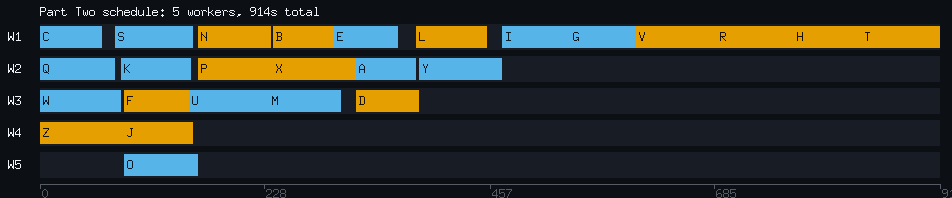
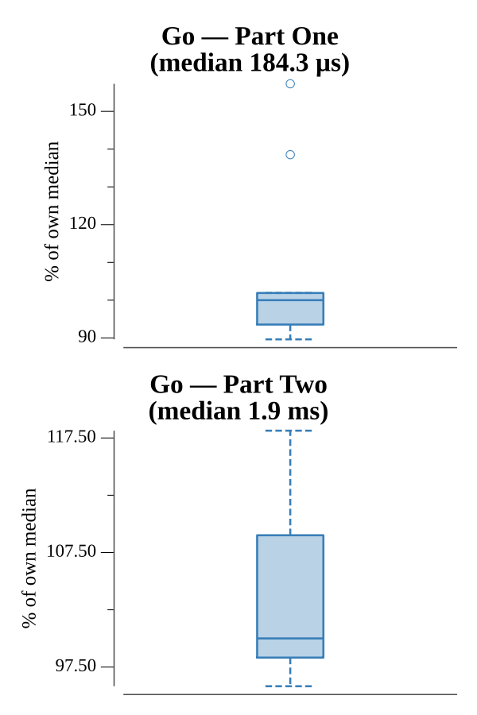

# [Day 7: The Sum of Its Parts](https://adventofcode.com/2018/day/7)

<!-- [Day 7: The Sum of Its Parts](07-theSumOfItsParts) -->

## Notes

The instructions form a dependency graph; each `Step X must be finished before
step Y can begin` line is an edge, and we track for every step the set of steps
that must precede it.

- **Part One** is a lexicographic topological sort: repeatedly take the
  alphabetically first step whose prerequisites are all complete, append it to the
  order, and mark it done.
- **Part Two** simulates the work second by second with a pool of workers. Each
  second, finished steps are retired, then idle workers pick up ready steps
  (alphabetically first), each taking `base + letterIndex` seconds. The elapsed
  time when the last step finishes is the answer.

The example runs 2 workers with no base cost while the real puzzle runs 5 workers
with a 60-second base, so those parameters are chosen from the step count rather
than hardcoded.

## Go

```text
────────────────────────────────────────
─   2018 Day 7: The Sum of Its Parts   ─
────────────────────────────────────────

Solving (Go)…
1.0:  PASS             0.156ms
2.0:  PASS             1.659ms
```

## Python

```text
    < section intentionally left blank >
```

## Visualization

The Part Two worker schedule as a Gantt chart: one lane per worker, time running
left to right, each step a labeled bar from its start to its finish. Bars alternate
between Okabe-Ito blue and orange — distinct in hue *and* brightness — while idle
gaps stay dark. The picture shows why the total is 914 seconds: workers 4 and 5 go
idle early once their steps clear, and the long tail on worker 1 (`… V R H T`) is
the critical path that no amount of extra workers can shorten.



## Run Times


