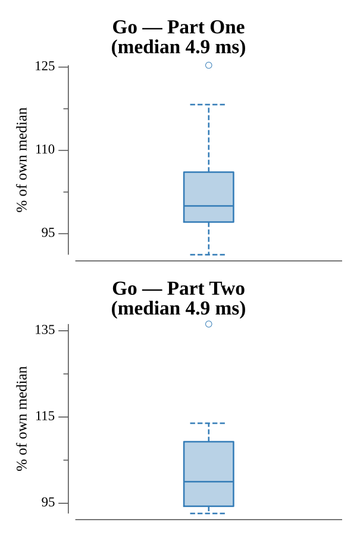

# [Day 8: Memory Maneuver](https://adventofcode.com/2018/day/8)

<!-- [Day 8: Memory Maneuver](08-memoryManeuver) -->

## Notes

The input is a flat list of numbers encoding a tree; each node is `childCount
metaCount`, then its children, then its metadata. A single recursive reader with
an index cursor walks the whole structure in one pass.

- **Part One** sums every metadata entry in the tree.
- **Part Two** computes the root's value: a leaf's value is the sum of its
  metadata, while an internal node's metadata are 1-based indices into its
  children, and its value is the sum of the referenced children's values
  (out-of-range indices skipped, repeats counted).

## Go

```text
────────────────────────────────────────
─    2018 Day 8: Memory Maneuver       ─
────────────────────────────────────────

Solving (Go)…
1.0:  PASS             5.263ms
2.0:  PASS             5.821ms
```

## Python

```text
    < section intentionally left blank >
```

## Run Times


