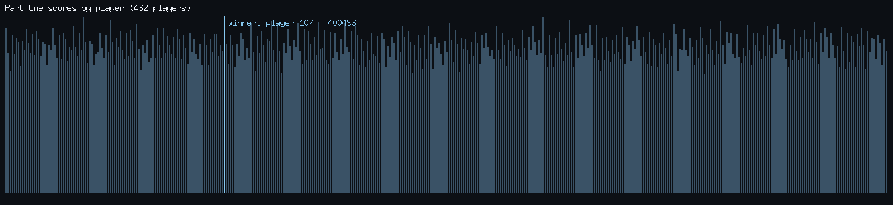
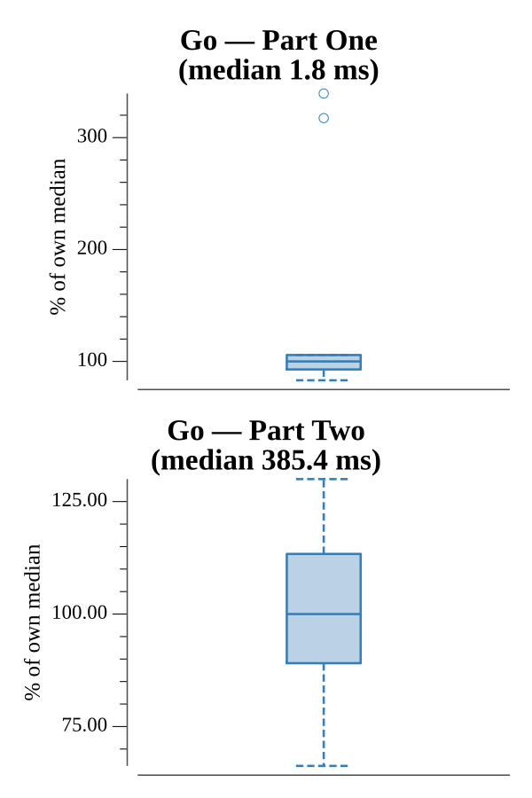

# [Day 9: Marble Mania](https://adventofcode.com/2018/day/9)

<!-- [Day 9: Marble Mania](09-marbleMania) -->

## Notes

The marble ring is a **circular doubly-linked list**, so both game moves are O(1):
a normal marble is inserted between the two marbles clockwise of the current one,
and every 23rd marble scores — the current player takes it plus the marble seven
counter-clockwise, which is then removed.

- **Part One** plays the game as given and reports the winning player's score.
- **Part Two** is the same game with the last marble worth 100 times as much (~7.1
  million marbles). The linked-list ring keeps every insert and removal constant
  time, so the larger game still finishes in well under a second — a slice-based
  ring, with its O(n) shifts, would not.

## Go

```text
────────────────────────────────────────
─      2018 Day 9: Marble Mania        ─
────────────────────────────────────────

Solving (Go)…
1.0:  PASS             1.846ms
2.0:  PASS           563.857ms
```

## Python

```text
    < section intentionally left blank >
```

## Visualization

The Part One game as a bar chart of every player's final score, in player order.
The winning player (107) is drawn bright and labeled; the rest share one dim tint,
so the winner reads by brightness alone and the chart survives grayscale. The
uneven profile comes from the every-23rd scoring marble landing on players in a
fixed cycle, so a player's take depends on their position modulo the scoring
period.



## Run Times


