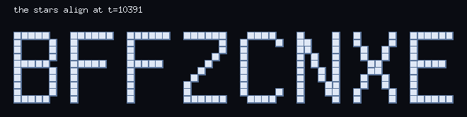
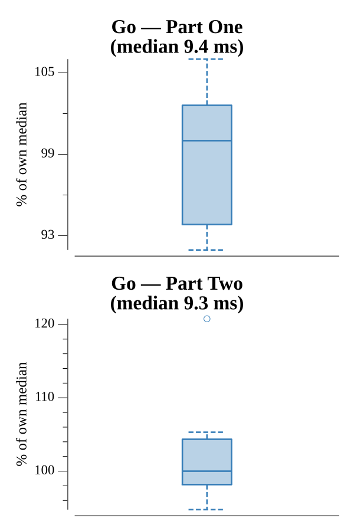

# [Day 10: The Stars Align](https://adventofcode.com/2018/day/10)

<!-- [Day 10: The Stars Align](10-theStarsAlign) -->

## Notes

Each star drifts at a constant velocity. The message appears at the one instant the
stars are tightest, which is the time that minimizes their bounding-box extent
(width + height). The extent shrinks to that minimum and then grows, so we step
forward while it keeps shrinking and stop at the turn.

- **Part One** renders that frame as solid blocks; the letters read **BFFZCNXE**.
- **Part Two** is the convergence time itself — **10391** seconds.

The rendered grid is returned as the answer (solid `█` blocks are far easier to
read than `#`).

## Go

```text
█████   ██████  ██████  ██████   ████   █    █  █    █  ██████
█    █  █       █            █  █    █  ██   █  █    █  █
█    █  █       █            █  █       ██   █   █  █   █
█    █  █       █           █   █       █ █  █   █  █   █
█████   █████   █████      █    █       █ █  █    ██    █████
█    █  █       █         █     █       █  █ █    ██    █
█    █  █       █        █      █       █  █ █   █  █   █
█    █  █       █       █       █       █   ██   █  █   █
█    █  █       █       █       █    █  █   ██  █    █  █
█████   █       █       ██████   ████   █    █  █    █  ██████
```

## Python

```text
    < section intentionally left blank >
```

## Visualization

The stars caught at the moment they align into the message. Each star is a bright
point on a dark field; the frame is the tightest-bounding-box instant found by the
solver. Brightness alone carries the letters, so the picture reads in grayscale.



## Run Times


