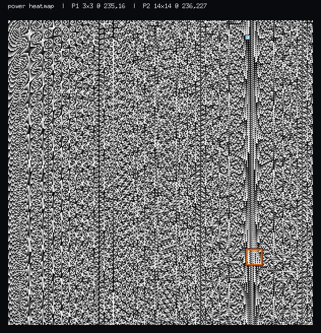
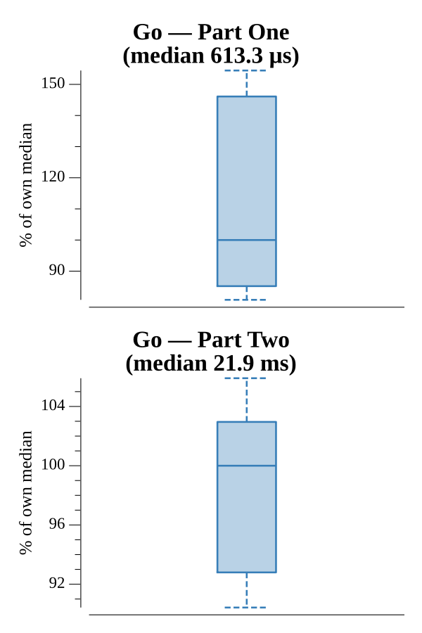

# [Day 11: Chronal Charge](https://adventofcode.com/2018/day/11)

<!-- [Day 11: Chronal Charge](11-chronalCharge) -->

## Notes

Each cell's power comes from the coordinate-and-serial formula, over a 300×300
grid. The key structure is a **summed-area table** — a prefix sum where each entry
holds the total power of the rectangle from `(1,1)` to that cell — so any square's
total is a four-corner O(1) lookup.

- **Part One** scans every 3×3 square for the largest total and reports its
  top-left corner.
- **Part Two** does the same across *all* square sizes 1–300. With the table making
  each square O(1), the whole search is O(gridSize³) and finishes in a fraction of
  a second.

## Go

```text
────────────────────────────────────────
─     2018 Day 11: Chronal Charge      ─
────────────────────────────────────────

Solving (Go)…
1.0:  PASS             0.609ms
2.0:  PASS            21.233ms
```

## Python

```text
    < section intentionally left blank >
```

## Visualization

The 300×300 grid as a power heatmap — brighter cells carry more power. The
`rackID` term gives the field its striking vertical-band moiré texture. The Part
One 3×3 square (thin blue) and the Part Two 14×14 square (thick orange) are
outlined with a dark halo so they stand out over any brightness; both land in the
bright high-power band on the right, which is exactly why they win. The boxes
differ in line weight as well as hue, so the picture reads in grayscale.



## Run Times


