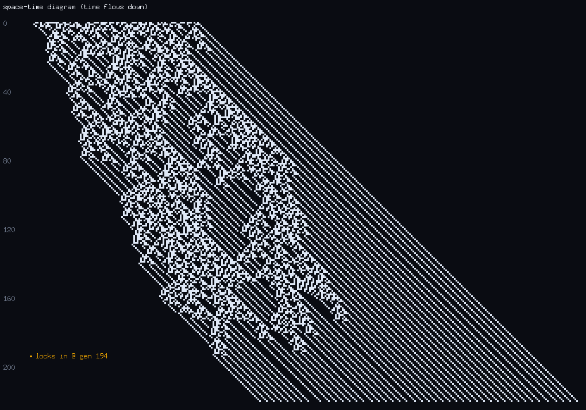
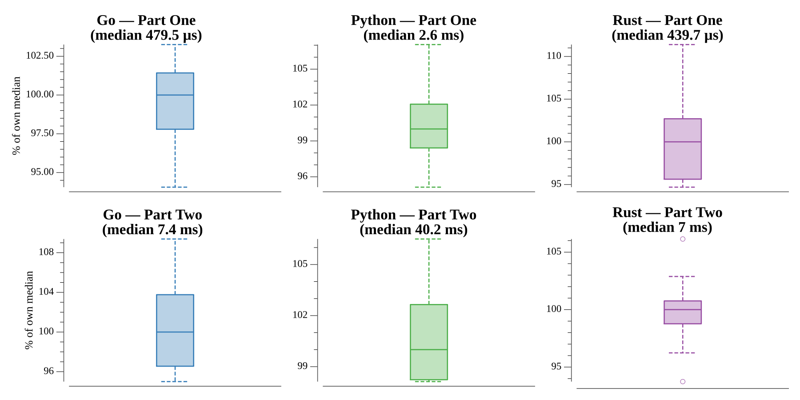

# [Day 12: Subterranean Sustainability](https://adventofcode.com/2018/day/12)

<!-- These are helper text to make formatting the yearly readme consistent and easier...

[Day 12: Subterranean Sustainability][rm12]
[Go][go12]
[Rust][rs12]
[Python][py12]

[rm12]: 12-subterraneanSustainability/README.md
[go12]: 12-subterraneanSustainability/go
[rs12]: 12-subterraneanSustainability/rs
[py12]: 12-subterraneanSustainability/py

-->

## Notes

A one-dimensional cellular automaton: each generation, a pot's next state comes
from a rule keyed on its five-pot neighborhood. The pots live in a `map[int]bool`
so the pattern can grow left or right without bounds.

- **Part One** runs 20 generations and sums the indices of the planted pots.
- **Part Two** runs 50 billion generations, which is only feasible because the
  pattern settles into a fixed shape that drifts sideways by a constant offset
  each generation. Once a normalized shape repeats, the planted count is fixed, so
  the index sum grows linearly and the remaining generations are extrapolated
  rather than simulated.

## Go

```text
────────────────────────────────────────
─ 2018 Day 12: Subterranean Sustainab… ─
────────────────────────────────────────

Solving (Go)…
1.0:  PASS             0.534ms
2.0:  PASS             8.266ms
```

## Rust

Pots are a `HashSet<i64>` of planted indices, and each rule's five-pot
neighborhood is packed into a `u8` bit mask so a generation step is a set of mask
lookups with no string allocation on the hot path. Part Two records each
normalized `shape` (leftmost-anchored pattern string plus its offset) in a
`HashMap`; when a shape recurs, the planted count is fixed and the pattern merely
drifts by a constant offset per generation, so the index sum is extrapolated to
the 50-billionth generation instead of simulated.

```text
────────────────────────────────────────
─      2018 Day 12: Subterranean       ─
─            Sustainability            ─
────────────────────────────────────────

Solving (Rust)…
1.0:  PASS             0.517ms
2.0:  PASS            10.209ms
```

## Python

Pots are a `set` of planted indices and rules a `set` of neighborhood strings, so
a generation step reads directly. Part Two keys a `dict` on the normalized shape
string; the first time a shape repeats, the pattern has locked into a fixed form
that only shifts sideways at constant speed, so the remaining generations to
50 billion are extrapolated linearly (`sum + remaining * count * drift //
period`) rather than iterated.

```text
────────────────────────────────────────
─      2018 Day 12: Subterranean       ─
─            Sustainability            ─
────────────────────────────────────────

Solving (Python)…
1.0:  PASS             2.454ms
2.0:  PASS            37.274ms
```

## Visualization

The automaton as a space-time diagram: time flows downward, one row per
generation, planted pots drawn bright. The early generations churn, then the
pattern resolves into clean parallel diagonal streaks — the fixed shape drifting
sideways at constant speed. That steady drift is exactly what lets Part Two skip
50 billion generations: once the diagonals are straight, the index sum just grows
linearly. The generation where the shape locks in is marked.



## Run Times


