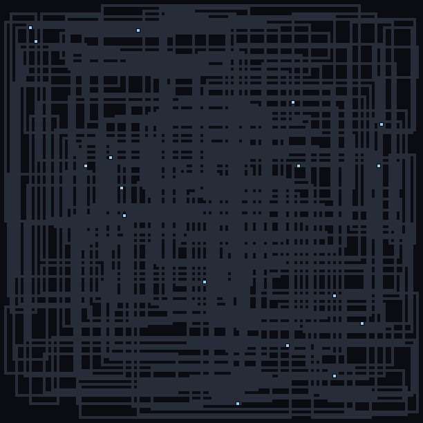
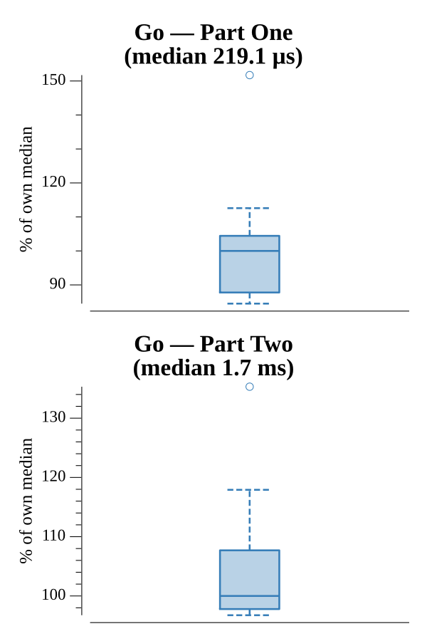

# [Day 13: Mine Cart Madness](https://adventofcode.com/2018/day/13)

<!-- [Day 13: Mine Cart Madness](13-mineCartMadness) -->

## Notes

Carts ride a track of straights, curves (`/` `\`), and intersections (`+`). The
carts are lifted off the grid at parse time, each remembering the straight track
it was sitting on, so the map underneath stays intact. Every tick the carts move
in reading order; a curve reflects the heading and an intersection cycles the cart
through left, straight, right.

- **Part One** reports the location of the first collision.
- **Part Two** instead removes both carts in every collision and keeps going until
  a single cart remains, reporting its position at the end of that tick.

## Go

```text
────────────────────────────────────────
─    2018 Day 13: Mine Cart Madness    ─
────────────────────────────────────────

Solving (Go)…
1.0:  PASS             0.222ms
2.0:  PASS             1.795ms
```

## Python

```text
    < section intentionally left blank >
```

## Visualization

An animation of the carts running the track. The track is drawn dim; live carts
are bright blue and every crash leaves a lingering orange marker, each haloed so it
stays legible over the busy network. There are more than ten thousand ticks, so
frames are sampled — but any tick with a crash is always captured, so every wreck
and the final lone survivor appear. Events read by brightness and halo rather than
hue, so it works in grayscale too.



## Run Times


