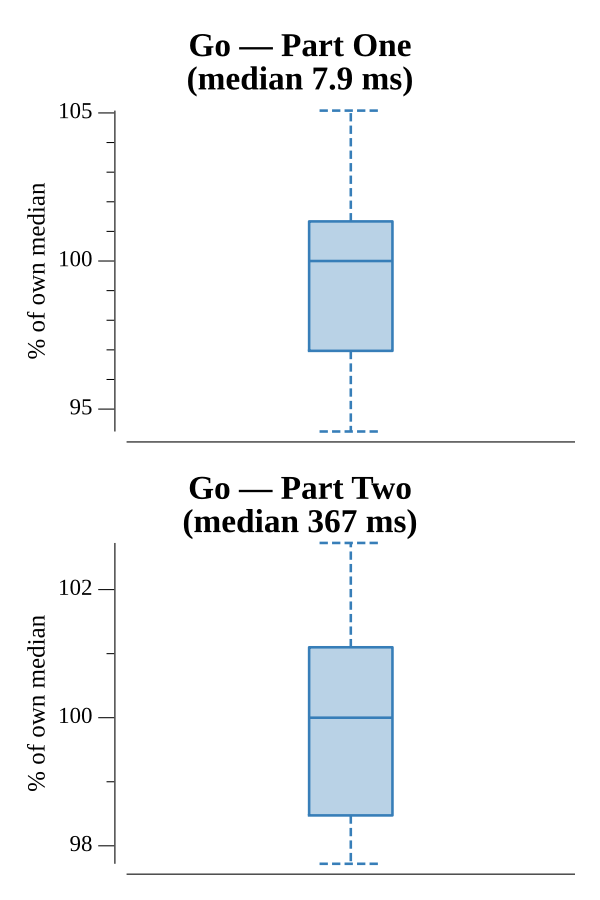

# [Day 14: Chocolate Charts](https://adventofcode.com/2018/day/14)

<!-- [Day 14: Chocolate Charts](14-chocolateCharts) -->

## Notes

Two elves build a scoreboard of single-digit recipes. Each step appends the digits
of their two current recipes' sum, then each elf steps forward by one plus its own
recipe. The board is a `[]byte` of digits that only ever grows.

- **Part One** treats the input as a count: build until there are ten recipes past
  it, then read those ten digits.
- **Part Two** treats the input as a digit pattern and reports how many recipes
  precede its first appearance. Since a step can append one or two digits, the tail
  is checked after every append, tracking how far it has already compared so no
  suffix is skipped across a two-digit step.

## Go

```text
────────────────────────────────────────
─    2018 Day 14: Chocolate Charts     ─
────────────────────────────────────────

Solving (Go)…
1.0:  PASS             8.264ms
2.0:  PASS           357.976ms
```

## Python

```text
    < section intentionally left blank >
```

## Run Times


