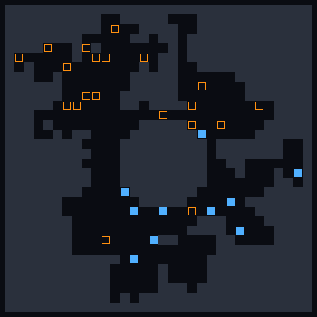
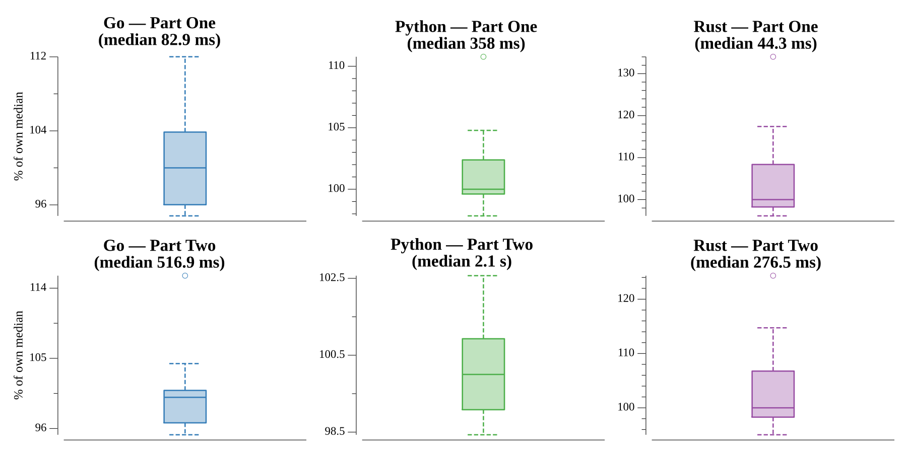

# [Day 15: Beverage Bandits](https://adventofcode.com/2018/day/15)

<!-- These are helper text to make formatting the yearly readme consistent and easier...

[Day 15: Beverage Bandits][rm15]
[Go][go15]
[Rust][rs15]
[Python][py15]

[rm15]: 15-beverageBandits/README.md
[go15]: 15-beverageBandits/go
[rs15]: 15-beverageBandits/rs
[py15]: 15-beverageBandits/py

-->

## Notes

A full combat simulation, and the day's difficulty is entirely in its tie-breaking
rules. Units act in reading order each round. A unit that is not already next to an
enemy finds the open squares in range of some enemy and takes one step along the
shortest path to the nearest of them — with *every* tie (which target square, which
first step) broken by reading order. It then attacks the adjacent enemy with the
fewest hit points, ties again by reading order.

The reading-order tie-breaks fall out of one trick: a breadth-first search that
expands neighbors up, left, right, down. Because those are the reading-order
directions, the first shortest path the search reaches a square by is already the
reading-order-minimal one, so the recorded first step is correct with no extra
sorting.

- **Part One** runs the fight to the end and reports full rounds × remaining hit
  points.
- **Part Two** raises the elves' attack power from 4 upward until they win with no
  elf deaths (the fight aborts the instant an elf falls), and reports that
  outcome.

## Go

```text
────────────────────────────────────────
─    2018 Day 15: Beverage Bandits     ─
────────────────────────────────────────

Solving (Go)…
1.0:  PASS            80.602ms
2.0:  PASS           473.436ms
```

## Rust

Units are a `Clone`-able struct held in a `Vec` and addressed by index throughout,
so the borrow checker stays happy while a unit is moved and then attacks. Movement
is a `VecDeque` BFS whose neighbor order is the reading-order directions
(up, left, right, down); the first shortest path to reach a square therefore records
the reading-order-minimal first step with no extra sorting. Each round re-sorts the
units by `(y, x)`, and part two re-runs the whole fight on a fresh parse per attack
power.

```text
────────────────────────────────────────
─    2018 Day 15: Beverage Bandits     ─
────────────────────────────────────────

Solving (Rust)…
1.0:  PASS            56.364ms
2.0:  PASS           340.989ms
```

## Python

`Unit` objects with `__slots__` live in a list re-sorted by `(y, x)` each round. The
BFS uses `collections.deque` with the same reading-order neighbor expansion, so the
double reading-order tie-break (destination square, then first step) falls out of
discovery order. Part two walks the elf attack power up from 4, re-parsing the cave
each attempt and bailing the instant an elf dies.

```text
────────────────────────────────────────
─    2018 Day 15: Beverage Bandits     ─
────────────────────────────────────────

Solving (Python)…
1.0:  PASS              0.331s
2.0:  PASS              2.218s
```

## Visualization

An animation of the part-two winning battle — the lowest elf attack power at which
no elf dies — one frame per round. Walls are dim; elves are bright filled blocks
and goblins are hollow rings, so the two sides differ by shape as well as color and
stay distinct in grayscale. Units dim as their hit points fall and vanish on death.
By the final frame only elves remain, which is exactly the condition part two
searches for.



## Run Times


