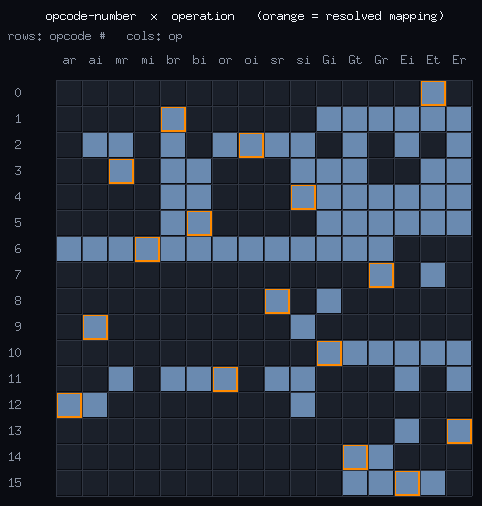
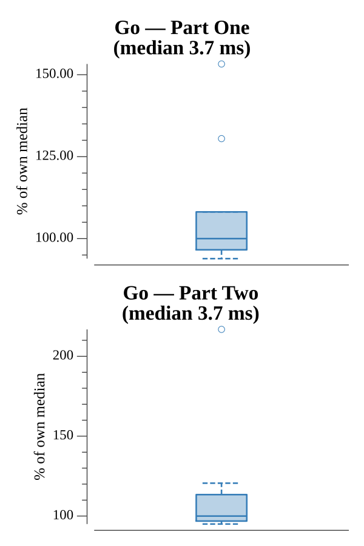

# [Day 16: Chronal Classification](https://adventofcode.com/2018/day/16)

<!-- [Day 16: Chronal Classification](16-chronalClassification) -->

## Notes

The device has sixteen operations (register/immediate variants of add, multiply,
bitwise and/or, assignment, and greater-than/equality tests). The input gives
Before/After samples for numbered opcodes, then a program using those numbers.

- **Part One** counts the samples that behave like three or more of the sixteen
  operations.
- **Part Two** deduces which number is which operation: each opcode's candidate set
  is the operations consistent with every sample that uses it, then the mapping is
  resolved by elimination — any opcode left with a single candidate is fixed and
  that operation is struck from the others, repeating until all sixteen are pinned.
  The program is then run and register 0 read out.

## Go

```text
────────────────────────────────────────
─ 2018 Day 16: Chronal Classification  ─
────────────────────────────────────────

Solving (Go)…
1.0:  PASS             3.842ms
2.0:  PASS             4.605ms
```

## Python

```text
    < section intentionally left blank >
```

## Visualization

The opcode deduction as a 16×16 matrix: rows are opcode numbers, columns the
sixteen operations. A cell is bright where that operation is still a candidate for
the number (consistent with every sample) and dark where it is ruled out; the one
operation the solver pins down for each number is boxed. You can read the puzzle's
structure directly — some numbers start nearly unambiguous while opcode 6 is
consistent with almost every operation — and the boxes trace the one-to-one mapping
that elimination recovers. Candidacy is carried by brightness and the resolution by
the box, so it reads in grayscale.



## Run Times


