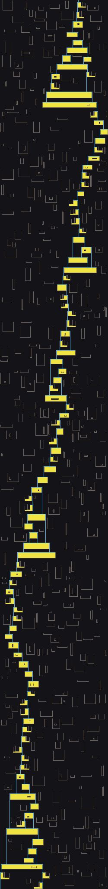
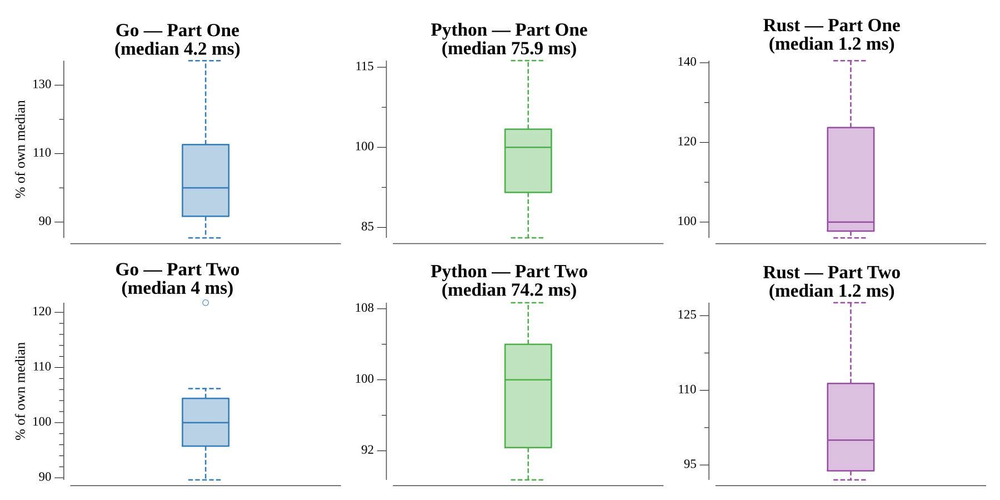

# [Day 17: Reservoir Research](https://adventofcode.com/2018/day/17)

<!-- These are helper text to make formatting the yearly readme consistent and easier...

[Day 17: Reservoir Research][rm17]
[Go][go17]
[Rust][rs17]
[Python][py17]

[rm17]: 17-reservoirResearch/README.md
[go17]: 17-reservoirResearch/go
[rs17]: 17-reservoirResearch/rs
[py17]: 17-reservoirResearch/py

-->

## Notes

Clay veins are horizontal and vertical line segments; water pours from a spring at
`x=500, y=0`. A recursive flood-fill drops water down until it lands on a floor
(clay or already-settled water), then spreads sideways across that floor. A row
walled by clay on **both** sides settles into standing water (`~`) and becomes a
floor for the row above; a row open on either side stays flowing (`|`) and spills
down over the open edge.

The subtlety that makes this puzzle bite: spreading is not a single left/right
scan. When a side reaches an open edge, water spills down it — and if that spill
fills a lower basin that then **settles**, the newly-settled tile becomes a floor,
so the row has to keep extending past that edge. The spread loop therefore spills,
and only stops when a spill escapes (falls through without settling). A worked
example without a spill-becomes-floor dependency will pass even a solver that scans
only once, so this case has to be exercised deliberately.

- **Part One** counts every tile water can reach — flowing `|` plus settled `~` —
  within the clay's `y` range.
- **Part Two** counts only the retained water (`~`), i.e. what stays after the
  spring is switched off.

## Go

```text
────────────────────────────────────────
─   2018 Day 17: Reservoir Research    ─
────────────────────────────────────────

Solving (Go)…
1.0:  PASS             4.734ms
2.0:  PASS             4.781ms
```

## Rust

A flat `Vec<u8>` grid keyed by an `(x, y)` offset keeps the fill cache-friendly and
avoids hashing; tile states are plain `u8` constants. Rust's default stack absorbs
the deep recursion, and `part_two` just recounts the same simulation.

```text
────────────────────────────────────────
─   2018 Day 17: Reservoir Research    ─
────────────────────────────────────────

Solving (Rust)…
1.0:  PASS             1.743ms
2.0:  PASS             1.556ms
```

## Python

A sparse `dict[(x, y)] -> tile` grid reads cleanly, and `re.findall` pulls the three
integers off each vein regardless of orientation. Each part runs its own flood-fill
(mirroring the Go and Rust structure), and the recursion limit is raised to clear the
deep water column.

```text
────────────────────────────────────────
─   2018 Day 17: Reservoir Research    ─
────────────────────────────────────────

Solving (Python)…
1.0:  PASS           165.201ms
2.0:  PASS           147.134ms
```

## Visualization

The final reservoir, cropped to the wet region and drawn as SVG so it stays crisp
at any zoom. The spring enters at the top and the water cascades down the full
~2000-tile depth: settled water (bright yellow) fills each basin to the brim, then
spills over a wall as a thin flowing stream (blue) that drops to the next basin
below. Clay veins are the dimmer gray lines scattered across the near-black sand.
Because the four states separate purely by brightness — sand darkest, then clay,
then flowing water, then settled water brightest — the whole cascade still reads in
grayscale. Water is drawn as greedily-merged solid rectangles (so basins have no
internal seams) and each clay vein as one thin rect. Every coordinate is an integer
and the SVG uses `shape-rendering="crispEdges"`, so the shapes snap to the pixel
grid with no anti-aliasing, and the vector file stays small.



## Run Times


