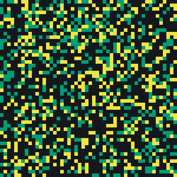
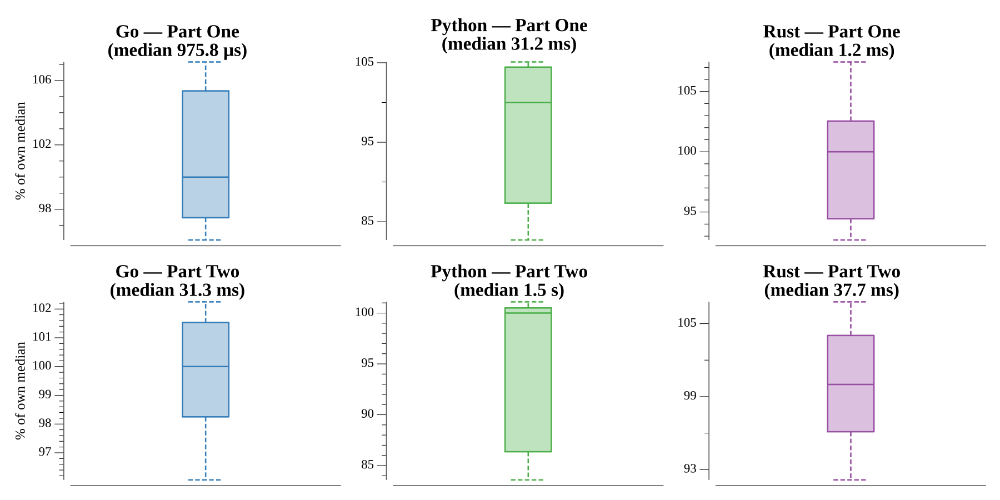

# [Day 18: Settlers of The North Pole](https://adventofcode.com/2018/day/18)

<!-- These are helper text to make formatting the yearly readme consistent and easier...

[Day 18: Settlers of The North Pole][rm18]
[Go][go18]
[Rust][rs18]
[Python][py18]

[rm18]: 18-settlersOfTheNorthPole/README.md
[go18]: 18-settlersOfTheNorthPole/go
[rs18]: 18-settlersOfTheNorthPole/rs
[py18]: 18-settlersOfTheNorthPole/py

-->

## Notes

The acre map is a cellular automaton. Every minute each acre changes together based
on its eight neighbors:

- **open** becomes **trees** if three or more neighbors are trees;
- **trees** become a **lumberyard** if three or more neighbors are lumberyards;
- a **lumberyard** stays a lumberyard only if it neighbors at least one lumberyard
  **and** at least one acre of trees, otherwise it reverts to open.

The resource value is the number of wooded acres times the number of lumberyards.

- **Part One** runs ten minutes and reports the resource value.
- **Part Two** runs one billion minutes — far too many to simulate. The finite grid
  must eventually repeat, so each state is stored against the minute it first
  appeared; when a state recurs the cycle length is known, and the remaining
  minutes collapse to `(1_000_000_000 - minute) % period` more steps.

## Go

```text
────────────────────────────────────────
─  2018 Day 18: Settlers of The North  ─
─                 Pole                 ─
────────────────────────────────────────

Solving (Go)…
1.0:  PASS             1.408ms
2.0:  PASS            42.180ms
```

## Rust

A flat `Vec<u8>` grid keeps stepping cache-friendly, and the cycle map is keyed on
the raw cell bytes (`HashMap<Vec<u8>, usize>`). The step rules fall out cleanly as a
`match` with guards.

```text
────────────────────────────────────────
─  2018 Day 18: Settlers of The North  ─
─                 Pole                 ─
────────────────────────────────────────

Solving (Rust)…
1.0:  PASS             1.375ms
2.0:  PASS            41.704ms
```

## Python

A list-of-lists grid, with the flattened string as the hashable state key for cycle
detection. Neighbor counting is a plain tally over the clamped 3×3 window — readable
and fast enough that the billion-minute part finishes in a couple of seconds after
the cycle is found.

```text
────────────────────────────────────────
─  2018 Day 18: Settlers of The North  ─
─                 Pole                 ─
────────────────────────────────────────

Solving (Python)…
1.0:  PASS              0.036s
2.0:  PASS              1.578s
```

## Visualization

The automaton evolving, one frame per minute. It starts as random noise, quickly
coalesces into forests (mid-gray) fringed with lumberyards (bright), thins out, and
then locks into the swirling steady pattern that drives Part Two. The early minutes
play in full; the long warm-up is sampled every few minutes to keep the file small;
then the 28-minute cycle the state settles into is shown twice, so you can watch it
repeat. The three acre types read by brightness alone — open darkest, trees mid,
lumberyard brightest — so the animation still works in grayscale.



## Run Times


