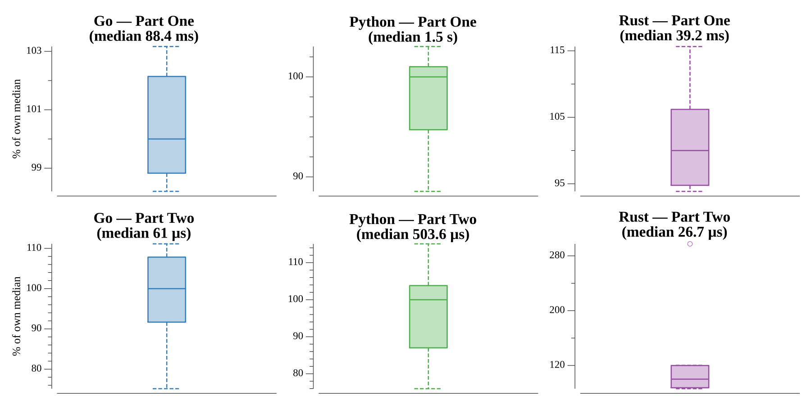

# [Day 19: Go With The Flow](https://adventofcode.com/2018/day/19)

<!-- These are helper text to make formatting the yearly readme consistent and easier...

[Day 19: Go With The Flow][rm19]
[Go][go19]
[Rust][rs19]
[Python][py19]

[rm19]: 19-goWithTheFlow/README.md
[go19]: 19-goWithTheFlow/go
[rs19]: 19-goWithTheFlow/rs
[py19]: 19-goWithTheFlow/py

-->

## Notes

The same sixteen-opcode device as day 16, but now the `#ip` directive binds one
register to the instruction pointer: before each instruction the ip is copied into
that register, and afterwards the register's value (plus one) becomes the next ip.
That lets the program branch and loop by writing to the bound register.

- **Part One** runs the program from all-zero registers until the ip leaves the
  instruction list, then reads register 0.
- **Part Two** starts with register 0 set to 1, which the puzzle warns takes far too
  long. Reading the assembly shows what it is: the setup block builds a large number
  in one register, and the main loop is a brute-force **sum of divisors** — a
  doubly-nested `O(n²)` scan for every factor pair. Rather than run that, the solver
  executes the VM for a few hundred steps until the number is assembled, reads it out
  (the largest register), and sums its divisors directly in `O(√n)`.

## Go

```text
────────────────────────────────────────
─    2018 Day 19: Go With The Flow     ─
────────────────────────────────────────

Solving (Go)…
1.0:  PASS           112.593ms
2.0:  PASS             0.060ms
```

## Rust

The opcode set is a `match` on the mnemonic, the VM is a small `run` loop, and the
divisor sum is a plain integer loop. Part one interprets the whole program; part two
runs only the setup then does arithmetic.

```text
────────────────────────────────────────
─    2018 Day 19: Go With The Flow     ─
────────────────────────────────────────

Solving (Rust)…
1.0:  PASS            53.205ms
2.0:  PASS             0.030ms
```

## Python

Each opcode is a one-line `lambda` in a dispatch dict, so the VM step is a single
table lookup. Part one interprets the program directly (the slow part, ~1.5 s); part
two runs the setup and then `math.isqrt`-bounded divisor summation, which is instant.

```text
────────────────────────────────────────
─    2018 Day 19: Go With The Flow     ─
────────────────────────────────────────

Solving (Python)…
1.0:  PASS              1.578s
2.0:  PASS              0.001s
```

## Run Times


