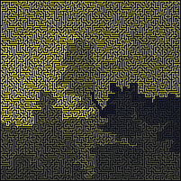
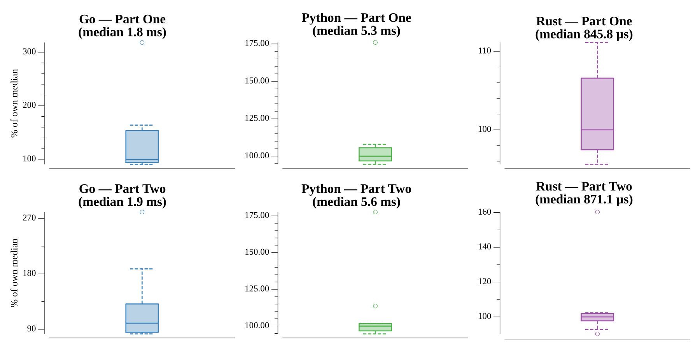

# [Day 20: A Regular Map](https://adventofcode.com/2018/day/20)

<!-- These are helper text to make formatting the yearly readme consistent and easier...

[Day 20: A Regular Map][rm20]
[Go][go20]
[Rust][rs20]
[Python][py20]

[rm20]: 20-aRegularMap/README.md
[go20]: 20-aRegularMap/go
[rs20]: 20-aRegularMap/rs
[py20]: 20-aRegularMap/py

-->

## Notes

The input is a route regex bounded by `^`/`$`, using `NSEW` for door moves, `|` for
alternatives and `(…)` for grouping. Walking it with a stack of positions builds the
map:

- `(` pushes the current room;
- `|` resets to the top of the stack (the start of this group) for the next branch;
- `)` pops back to the group's start;
- each `NSEW` steps to the neighbor and records `dist = min(existing, prev + 1)`.

Because every door traversal costs exactly one step, keeping the minimum distance on
revisits gives the true shortest distance to each room during the walk — no separate
BFS is needed.

- **Part One** is the largest distance in the map (the furthest room).
- **Part Two** counts the rooms whose shortest distance is at least 1000 doors.

## Go

```text
────────────────────────────────────────
─      2018 Day 20: A Regular Map      ─
────────────────────────────────────────

Solving (Go)…
1.0:  PASS             2.321ms
2.0:  PASS             2.932ms
```

## Rust

A `HashMap<(i32, i32), u32>` distance map and a `Vec` position stack; the walk is a
single `match` over the route bytes. `values().max()` and a filtered `count()` give
the two answers.

```text
────────────────────────────────────────
─      2018 Day 20: A Regular Map      ─
────────────────────────────────────────

Solving (Rust)…
1.0:  PASS             1.030ms
2.0:  PASS             0.917ms
```

## Python

Rooms are complex numbers — `pos += 1j` for south, `-= 1` for west — so each room is
a single hashable coordinate and the walk reads directly off a `{move: delta}` table.
The distance map is a plain dict shared by both parts.

```text
────────────────────────────────────────
─      2018 Day 20: A Regular Map      ─
────────────────────────────────────────

Solving (Python)…
1.0:  PASS             6.192ms
2.0:  PASS             6.213ms
```

## Visualization

The whole facility drawn as a maze — one pixel per room, with a pixel of door
between connected neighbors and walls left black. Each room is shaded by its
shortest distance from the origin: dark navy at the start, brightening to yellow at
the furthest rooms. The dark pocket marks where you begin, and the glow spreading
outward traces how distance grows through the passages — the bright edges are the
furthest rooms (Part One) and the deep ≥1000-door regions (Part Two). Distance maps
straight to brightness, so the gradient reads unchanged in grayscale.



## Run Times


