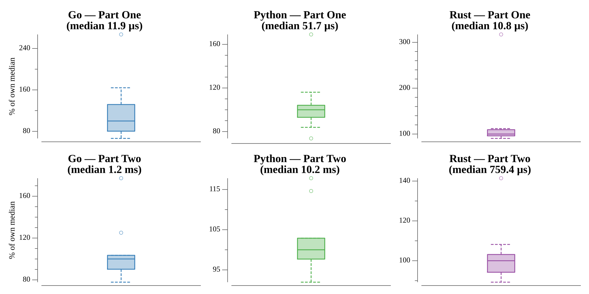

# [Day 21: Chronal Conversion](https://adventofcode.com/2018/day/21)

<!-- These are helper text to make formatting the yearly readme consistent and easier...

[Day 21: Chronal Conversion][rm21]
[Go][go21]
[Rust][rs21]
[Python][py21]

[rm21]: 21-chronalConversion/README.md
[go21]: 21-chronalConversion/go
[rs21]: 21-chronalConversion/rs
[py21]: 21-chronalConversion/py

-->

## Notes

The bound-ip opcode machine from day 19 again. The program has exactly one place it
can halt: an `eqrr … 0` instruction that compares register 0 (the number we choose)
against a value the program keeps recomputing. Whatever value that comparison holds,
setting register 0 to it makes the program stop there.

- **Part One** is the value that halts the program in the *fewest* instructions —
  simply the *first* value the comparison ever sees.
- **Part Two** is the value that halts it after the *most* instructions without
  looping forever — the *last distinct* value the comparison sees before the
  sequence of values starts repeating.

The program's inner loop is an `O(n)` digit-by-digit division of a number by 256, so
interpreting it opcode by opcode takes tens of seconds for part two. Instead the two
per-input constants are read out of the program — the seed the running value is
reset to (a `seti`) and the multiplier (a `muli`) — and the recurrence is evaluated
directly:

```
hi = acc | 0x10000; acc = seed
repeat: acc = ((acc + (hi & 0xFF)) & 0xFFFFFF) * mult & 0xFFFFFF
        if hi < 256: break
        hi //= 256
```

Collecting these values until one repeats gives the whole cycle in a few
milliseconds; the first and last entries are the two answers.

## Go

The recurrence is walked through a yield callback (`func(int) bool`), so part one
stops after the first halt value while part two runs to the last before the cycle
repeats — neither computes more of the sequence than it needs.

```text
────────────────────────────────────────
─   2018 Day 21: Chronal Conversion    ─
────────────────────────────────────────

Solving (Go)…
1.0:  PASS             0.016ms
2.0:  PASS             1.431ms
```

## Rust

The constants are pulled out with iterator adapters over the split instructions,
then the recurrence is exposed as a lazy `iter::from_fn` iterator: part one takes
`.next()` and part two `.last()`, so neither generates more of the cycle than it needs.

```text
────────────────────────────────────────
─   2018 Day 21: Chronal Conversion    ─
────────────────────────────────────────

Solving (Rust)…
1.0:  PASS             0.037ms
2.0:  PASS             0.910ms
```

## Python

The halt values come from a generator, so part one is `next(...)` and part two
consumes it to the last value before the cycle closes — one source of truth, no flag
parameter.

```text
────────────────────────────────────────
─   2018 Day 21: Chronal Conversion    ─
────────────────────────────────────────

Solving (Python)…
1.0:  PASS             0.036ms
2.0:  PASS             7.698ms
```

## Run Times


