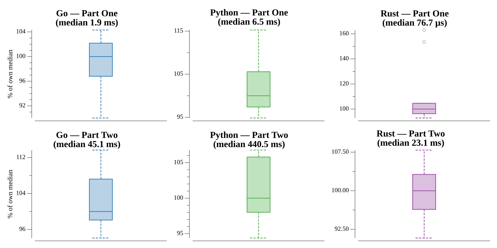

# [Day 22: Mode Maze](https://adventofcode.com/2018/day/22)

<!-- These are helper text to make formatting the yearly readme consistent and easier...

[Day 22: Mode Maze][rm22]
[Go][go22]
[Rust][rs22]
[Python][py22]

[rm22]: 22-modeMaze/README.md
[go22]: 22-modeMaze/go
[rs22]: 22-modeMaze/rs
[py22]: 22-modeMaze/py

-->

## Notes

Every region has a **geologic index** (a recurrence: 0 at the mouth and target, the
top row is `x·16807`, the left column is `y·48271`, otherwise the product of the
west and north neighbors' erosion levels). The **erosion level** is
`(geologic_index + depth) % 20183`, and the **region type** is `erosion % 3` —
rocky, wet, or narrow.

- **Part One** sums the risk (`erosion % 3`) over the rectangle from the mouth to
  the target.
- **Part Two** is a Dijkstra over `(x, y, tool)`. Moving to an adjacent region costs
  one minute; switching tools costs seven. Each region forbids the one tool equal to
  its type (rocky forbids neither, wet forbids the torch, narrow forbids the climbing
  gear), so a tool is usable in a region exactly when it differs from the region's
  type. You start at the mouth with the torch and must reach the target with the
  torch. The grid is unbounded, so the search extends a fixed margin past the target
  — a shortest path never detours further, since a seven-minute switch bounds any
  useful excursion.

## Go

```text
────────────────────────────────────────
─        2018 Day 22: Mode Maze        ─
────────────────────────────────────────

Solving (Go)…
1.0:  PASS             2.738ms
2.0:  PASS            73.306ms
```

## Rust

Erosion and distance are flat `Vec`s; the Dijkstra uses a `BinaryHeap` with
`Reverse` for a min-queue and a `(cost, x, y, tool)` key so ordering falls out of
the tuple.

```text
────────────────────────────────────────
─        2018 Day 22: Mode Maze        ─
────────────────────────────────────────

Solving (Rust)…
1.0:  PASS             0.129ms
2.0:  PASS            25.810ms
```

## Python

The region grid is built row by row, then `heapq` drives the Dijkstra over
`(cost, x, y, tool)` tuples with a dict of best-known distances.

```text
────────────────────────────────────────
─        2018 Day 22: Mode Maze        ─
────────────────────────────────────────

Solving (Python)…
1.0:  PASS             8.198ms
2.0:  PASS           522.094ms
```

## Visualization

The cave near the rescue route, one pixel per region — rocky, wet, and narrow shaded
from dark to light — with the optimal path from the mouth (white, top) to the target
(red) traced in gold. The target is only a dozen regions wide but hundreds deep, so
the map is a tall strip; the path weaves side to side to keep the right tool equipped
and avoid costly switches. A dark halo around the path keeps it legible over the
lightest terrain, so it still reads in grayscale.


## Run Times


