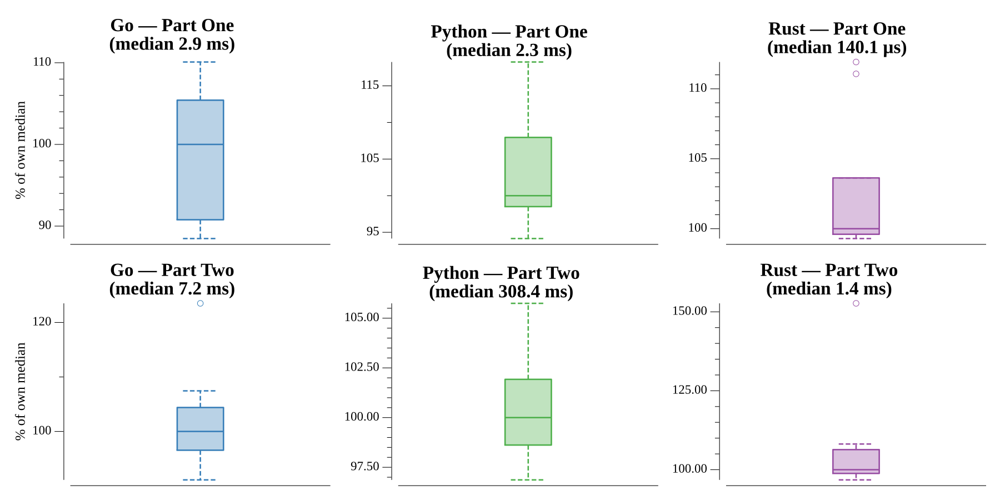

# [Day 23: Experimental Emergency Teleportation](https://adventofcode.com/2018/day/23)

<!-- These are helper text to make formatting the yearly readme consistent and easier...

[Day 23: Experimental Emergency Teleportation][rm23]
[Go][go23]
[Rust][rs23]
[Python][py23]

[rm23]: 23-experimentalEmergencyTeleportation/README.md
[go23]: 23-experimentalEmergencyTeleportation/go
[rs23]: 23-experimentalEmergencyTeleportation/rs
[py23]: 23-experimentalEmergencyTeleportation/py

-->

## Notes

Each nanobot has a 3D position and a signal radius (a Manhattan-distance ball).

- **Part One** finds the bot with the largest radius and counts how many bots lie
  within its range.
- **Part Two** finds the point that is in range of the *most* bots, breaking ties by
  distance to the origin. Brute force is hopeless over a ~160-million-wide space, so
  the search is an **octree**: start with a cube covering every bot and put it in a
  priority queue keyed by how many bots' ranges reach the cube, then closest to the
  origin, then smallest. Repeatedly pop the best cube and split it into eight
  half-cubes, re-scoring each. Because a cube can never be reached by more bots than
  its score claims, the first size-one cube popped is provably the optimal point, and
  its distance to the origin is the answer.

Scoring a cube counts bots whose range intersects it — the Manhattan distance from
the bot to the cube's nearest point (clamped per axis) must not exceed the bot's
radius.

## Go

```text
────────────────────────────────────────
─ 2018 Day 23: Experimental Emergency  ─
─            Teleportation             ─
────────────────────────────────────────

Solving (Go)…
1.0:  PASS             3.418ms
2.0:  PASS             9.351ms
```

## Rust

The cube's best-first ordering is a hand-written `Ord`, so `BinaryHeap` pops the
optimum directly — more bots in range wins, with distance and size compared in
reverse as tie-breakers.

```text
────────────────────────────────────────
─ 2018 Day 23: Experimental Emergency  ─
─            Teleportation             ─
────────────────────────────────────────

Solving (Rust)…
1.0:  PASS             0.171ms
2.0:  PASS             1.557ms
```

## Python

`heapq` over `(-in_range, dist, size, x, y, z)` tuples gives the same best-first
order with the natural min-heap — negating the bot count prefers fuller cubes.

```text
────────────────────────────────────────
─ 2018 Day 23: Experimental Emergency  ─
─            Teleportation             ─
────────────────────────────────────────

Solving (Python)…
1.0:  PASS             2.589ms
2.0:  PASS           350.749ms
```

## Run Times


