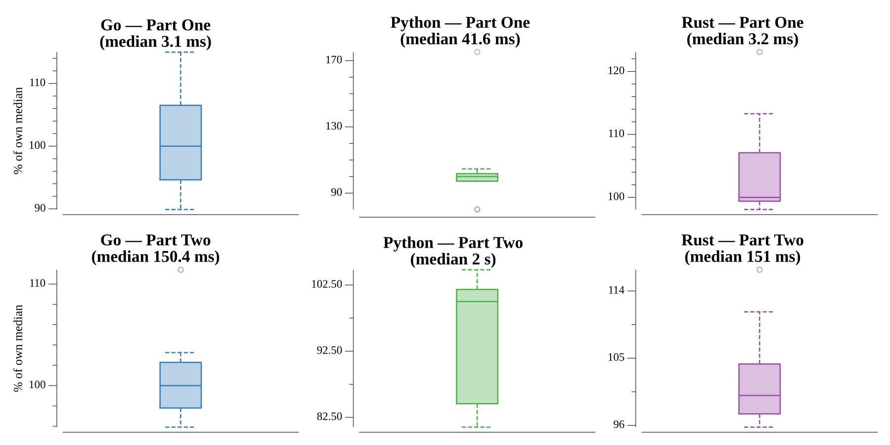

# [Day 24: Immune System Simulator 20XX](https://adventofcode.com/2018/day/24)

<!-- These are helper text to make formatting the yearly readme consistent and easier...

[Day 24: Immune System Simulator 20XX][rm24]
[Go][go24]
[Rust][rs24]
[Python][py24]

[rm24]: 24-immuneSystemSimulator20XX/README.md
[go24]: 24-immuneSystemSimulator20XX/go
[rs24]: 24-immuneSystemSimulator20XX/rs
[py24]: 24-immuneSystemSimulator20XX/py

-->

## Notes

Two armies of groups fight in rounds, each round with two phases:

1. **Target selection** — groups choose targets in order of decreasing effective
   power (units × attack damage), ties broken by initiative. Each group picks the
   still-untargeted enemy it would deal the most damage to; damage is doubled against
   a weakness and zero against an immunity, and ties there break on the enemy's
   effective power then initiative. Zero-damage matchups are skipped.
2. **Attack** — every group attacks its target in decreasing initiative order,
   killing `damage ÷ hit points` whole units.

The battle runs until one side is gone.

- **Part One** sums the surviving units of the winning army.
- **Part Two** finds the smallest attack boost added to every immune-system group
  that lets the immune system win. The one trap: some boosts produce a **stalemate**
  where a full round kills nobody and the battle would loop forever — a round with
  zero kills is detected and treated as the immune system not winning.

## Go

```text
────────────────────────────────────────
─ 2018 Day 24: Immune System Simulator ─
─                 20XX                  ─
────────────────────────────────────────

Solving (Go)…
1.0:  PASS             5.385ms
2.0:  PASS           202.779ms
```

## Rust

Groups are a `Clone`-able struct held in a `Vec`, addressed by index throughout
(targets, attack order) so re-fighting for each boost is a cheap clone. Sorting uses
`Reverse` keys for the descending phases.

```text
────────────────────────────────────────
─ 2018 Day 24: Immune System Simulator ─
─                 20XX                  ─
────────────────────────────────────────

Solving (Rust)…
1.0:  PASS             4.607ms
2.0:  PASS           232.801ms
```

## Python

A `@dataclass` group with `frozenset` weaknesses/immunities, so the two selection
sorts are one-line `sorted(key=…)` calls and `attack in weak` reads directly.
`deepcopy` gives each boost a fresh battle.

```text
────────────────────────────────────────
─ 2018 Day 24: Immune System Simulator ─
─                 20XX                  ─
────────────────────────────────────────

Solving (Python)…
1.0:  PASS              0.051s
2.0:  PASS              2.105s
```

## Run Times


