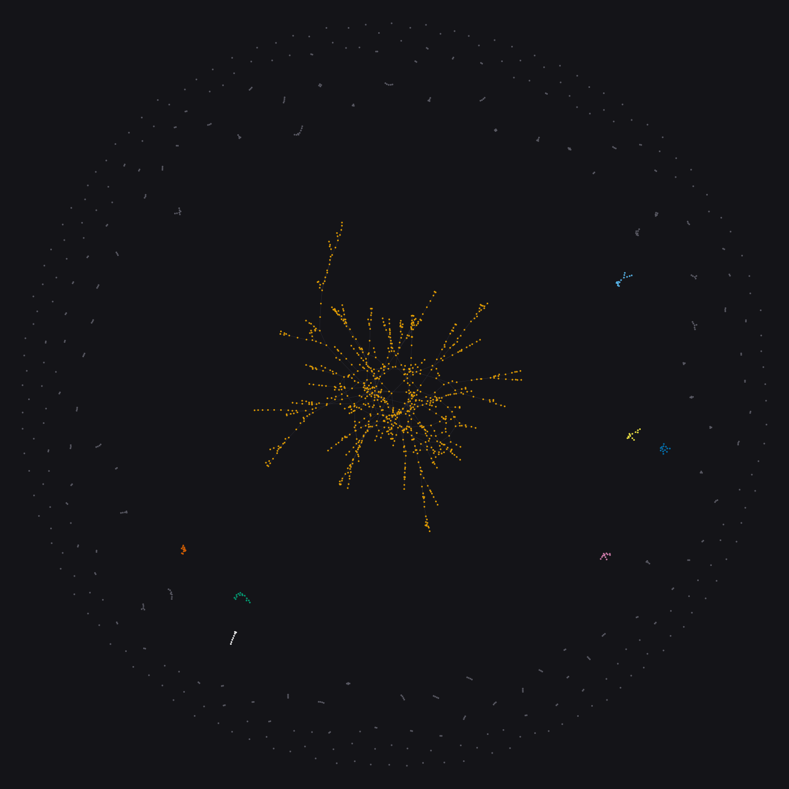
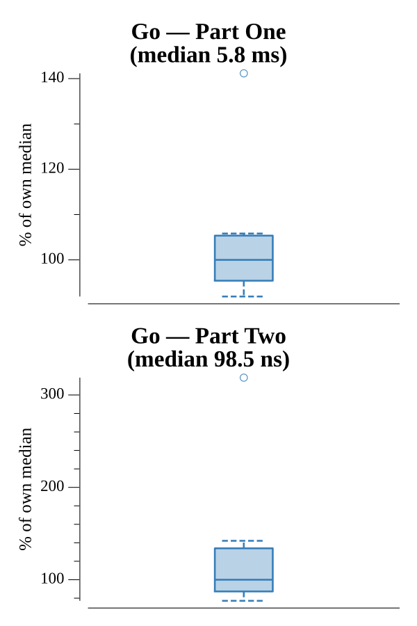

# [Day 25: Four-Dimensional Adventure](https://adventofcode.com/2018/day/25)

<!-- These are helper text to make formatting the yearly readme consistent and easier...

[Day 25: Four-Dimensional Adventure][rm25]
[Go][go25]

[rm25]: 25-four-DimensionalAdventure/README.md
[go25]: 25-four-DimensionalAdventure/go

-->

## Notes

Each line is a point in 4D space. Points belong to the same **constellation** when
they can be chained together through hops of Manhattan distance 3 or less — a
straightforward connected-components problem.

- **Part One** counts the constellations. A union-find (disjoint set) with path
  compression joins every pair of points within distance 3, then the answer is the
  number of distinct roots.
- **Part Two** is the traditional Day 25 finale: there is no second puzzle, only the
  closing message. The star is awarded for holding all 49 prior stars, so `Two`
  simply returns `Merry Christmas!`.

## Go

```text
────────────────────────────────────────
─    2018 Day 25: Four-Dimensional     ─
─              Adventure               ─
────────────────────────────────────────

Solving (Go)…
1.0:  PASS             5.909ms
2.0:  PASS             0.000ms
```

## Visualization

The constellation structure as a force-directed graph. Each dot is one of the 1482
points; a faint edge joins any two within Manhattan distance 3 (the relation that
merges them into a constellation). A Fruchterman-Reingold layout — every node
repels every other, edges pull like springs, and a gentle gravity keeps the whole
cloud together — lets each densely-linked constellation find its own shape. One
giant constellation dominates the center as a branching star-burst; the largest
handful get distinct Okabe-Ito colors, and the long tail of small and singleton
constellations rings the outside in gray. The count of separate islands is the
Part One answer, 324, made visible.



## Run Times


