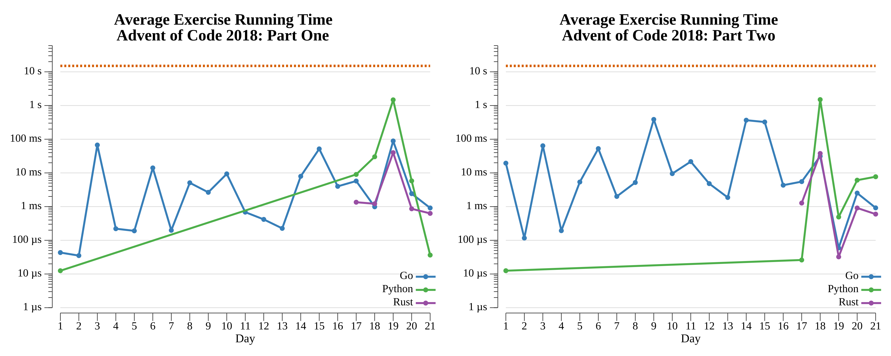

# Advent of Code: 2018

[Advent of Code 2018](https://adventofcode.com/2018) exercise solutions.

<!-- ★ ☆ -->

| Exercise                                                      | Stars | Solutions                      |
|---------------------------------------------------------------|:-----:|--------------------------------|
| [Day 1: Chronal Calibration](01-chronalCalibration/README.md) |  ★ ★  | [Go](01-chronalCalibration/go) |
| [Day 2: Inventory Management System](02-inventoryManagementSystem/README.md) |  ★ ★  | [Go](02-inventoryManagementSystem/go) |
| [Day 3: No Matter How You Slice It](03-noMatterHowYouSliceIt/README.md) |  ★ ★  | [Go](03-noMatterHowYouSliceIt/go) |
| [Day 4: Repose Record](04-reposeRecord/README.md) |  ★ ★  | [Go](04-reposeRecord/go) |
| [Day 5: Alchemical Reduction](05-alchemicalReduction/README.md) |  ★ ★  | [Go](05-alchemicalReduction/go) |
| [Day 6: Chronal Coordinates](06-chronalCoordinates/README.md) |  ★ ★  | [Go](06-chronalCoordinates/go) |
| [Day 7: The Sum of Its Parts](07-theSumOfItsParts/README.md) |  ★ ★  | [Go](07-theSumOfItsParts/go) |
| [Day 8: Memory Maneuver](08-memoryManeuver/README.md) |  ★ ★  | [Go](08-memoryManeuver/go) |
| [Day 9: Marble Mania](09-marbleMania/README.md) |  ★ ★  | [Go](09-marbleMania/go) |
| [Day 10: The Stars Align](10-theStarsAlign/README.md) |  ★ ★  | [Go](10-theStarsAlign/go) |
| [Day 11: Chronal Charge](11-chronalCharge/README.md) |  ★ ★  | [Go](11-chronalCharge/go) |
| [Day 12: Subterranean Sustainability](12-subterraneanSustainability/README.md) |  ★ ★  | [Go](12-subterraneanSustainability/go) |
| [Day 13: Mine Cart Madness](13-mineCartMadness/README.md) |  ★ ★  | [Go](13-mineCartMadness/go) |
| [Day 14: Chocolate Charts](14-chocolateCharts/README.md) |  ★ ★  | [Go](14-chocolateCharts/go) |
| [Day 15: Beverage Bandits](15-beverageBandits/README.md) |  ★ ★  | [Go](15-beverageBandits/go) |
| [Day 16: Chronal Classification](16-chronalClassification/README.md) |  ★ ★  | [Go](16-chronalClassification/go) |
| [Day 17: Reservoir Research](17-reservoirResearch/README.md) |  ★ ★  | [Go](17-reservoirResearch/go) · [Rust](17-reservoirResearch/rs) · [Python](17-reservoirResearch/py) |
| [Day 18: Settlers of The North Pole](18-settlersOfTheNorthPole/README.md) |  ★ ★  | [Go](18-settlersOfTheNorthPole/go) · [Rust](18-settlersOfTheNorthPole/rs) · [Python](18-settlersOfTheNorthPole/py) |
| [Day 19: Go With The Flow](19-goWithTheFlow/README.md) |  ★ ★  | [Go](19-goWithTheFlow/go) · [Rust](19-goWithTheFlow/rs) · [Python](19-goWithTheFlow/py) |
| [Day 20: A Regular Map](20-aRegularMap/README.md) |  ★ ★  | [Go](20-aRegularMap/go) · [Rust](20-aRegularMap/rs) · [Python](20-aRegularMap/py) |
| [Day 21: Chronal Conversion](21-chronalConversion/README.md) |  ★ ★  | [Go](21-chronalConversion/go) · [Rust](21-chronalConversion/rs) · [Python](21-chronalConversion/py) |
| 22                                                            |  ☆ ☆  |                                |
| 23                                                            |  ☆ ☆  |                                |
| 24                                                            |  ☆ ☆  |                                |
| 25                                                            |  ☆ ☆  |                                |

## 2018 Run Times



## 2018 Personal Leaderboard

```text
      --------Part 1--------   --------Part 2--------
Day       Time   Rank  Score       Time   Rank  Score
  1       >24h  95975      0       >24h  75133      0
```
