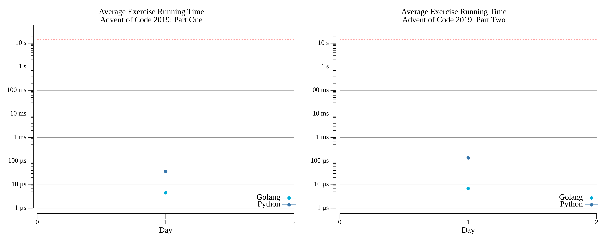

# [Day 1: The Tyranny Of The Rocket Equation](https://adventofcode.com/2019/day/1)

<!-- [Day 1: The Tyranny Of The Rocket Equation](01-theTyrannyOfTheRocketEquation) -->

## Go

```text
2019-1 The Tyranny Of The Rocket Equation (Golang)

Running...

Test 1.0: pass in 1.2 µs
Test 1.1: pass in 1.4 µs
Test 1.2: pass in 1.5 µs
Test 1.3: pass in 1.4 µs
Test 1.4: pass in 2.7 µs
Test 2.0: pass in 1.5 µs
Test 2.1: pass in 1.7 µs
Test 2.2: pass in 2.2 µs
Test 2.3: pass in 1.7 µs
Part 1: 3437969 in 4.7 µs
Part 2: 5154075 in 6.8 µs
```

## Python

```text
2019-1 The Tyranny Of The Rocket Equation (Python)

Running...

Test 1.0: pass in 5.00679 µs
Test 1.1: pass in 3.576279 µs
Test 1.2: pass in 8.821487 µs
Test 1.3: pass in 7.629395 µs
Test 1.4: pass in 8.106232 µs
Test 2.0: pass in 65.565109 µs
Test 2.1: pass in 10.967255 µs
Test 2.2: pass in 12.159348 µs
Test 2.3: pass in 35.28595 µs
Part 1: 3437969 in 28.371811 µs
Part 2: 5154075 in 139.474869 µs
```

## 2019 Run Times


