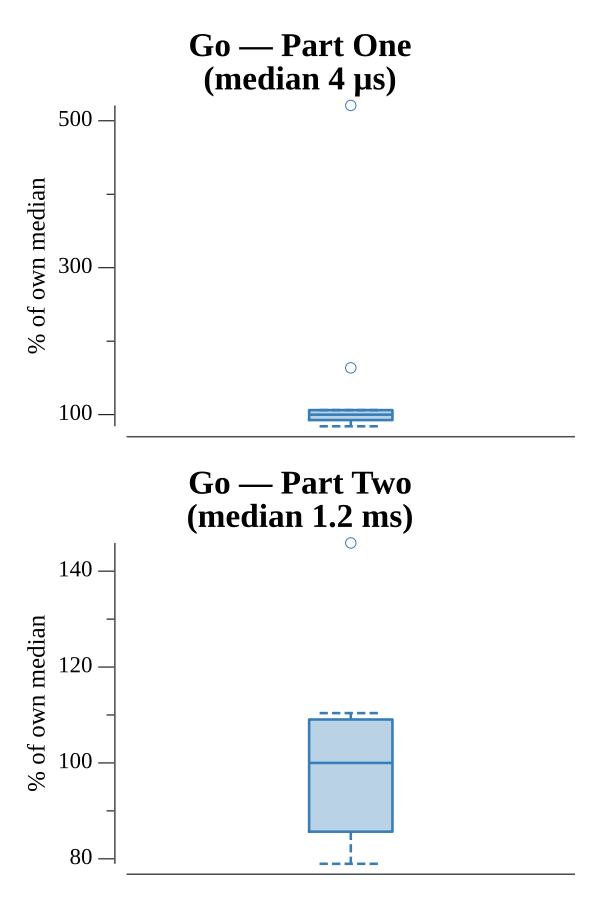

# [Day 2: 1202 Program Alarm](https://adventofcode.com/2019/day/2)

<!-- These are helper text to make formatting the yearly readme consistent and easier...

[Day 2: 1202 Program Alarm][rm2]
[Go][go2]
[Python][py2]

[rm2]: 02-1202ProgramAlarm/README.md
[go2]: 02-1202ProgramAlarm/go
[py2]: 02-1202ProgramAlarm/py

-->

## Notes

Part One applies the 1202 alarm fix — setting position 1 to `12` and position 2 to `2` — then runs the Intcode interpreter. The interpreter steps through opcodes 1 (add), 2 (multiply), and 99 (halt), writing results back into memory and returning the value at address 0.

Part Two brute-forces all noun/verb pairs in `[0, 99]`, running the interpreter from a fresh copy of the initial program for each pair, until `mem[0]` equals `19690720`. The answer is `100 * noun + verb`.

## Go

```text
Solving (Go)…
1.0:  PASS             0.004ms
2.0:  PASS             1.899ms
```

## Run Times



## 2019 Run Times


