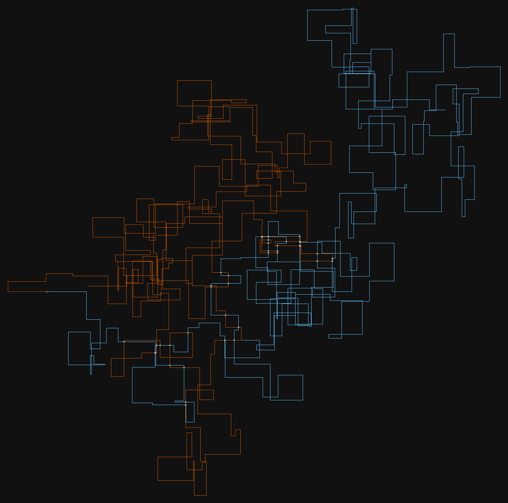
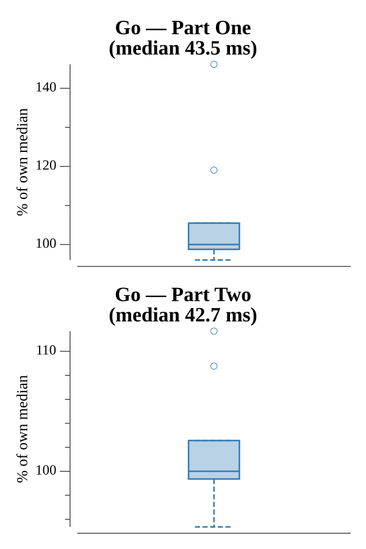

# [Day 3: Crossed Wires](https://adventofcode.com/2019/day/3)

<!-- These are helper text to make formatting the yearly readme consistent and easier...

[Day 3: Crossed Wires][rm3]
[Go][go3]
[Python][py3]

[rm3]: 03-crossedWires/README.md
[go3]: 03-crossedWires/go
[py3]: 03-crossedWires/py

-->

## Notes

Part One traces each wire step-by-step into a `map[point]int` (recording step count, first visit wins), finds every point present in both maps, and returns the minimum Manhattan distance from the origin across all intersections.

Part Two reuses the same infrastructure but returns the minimum sum of step counts at each intersection — the fewest combined steps the two wires take to reach a common point.

## Go

```text
Solving (Go)…
1.0:  PASS            45.437ms
2.0:  PASS            43.761ms
```

## Visualization

Both wire paths are drawn on a dark grid: wire 1 in bright blue (#56B4E9) and wire 2 in vivid orange (#C05000). Intersection points are marked with white cross markers. The blue wire reads lighter than the orange in grayscale, so the two paths remain distinguishable without relying on color alone.



## Run Times



## 2019 Run Times


