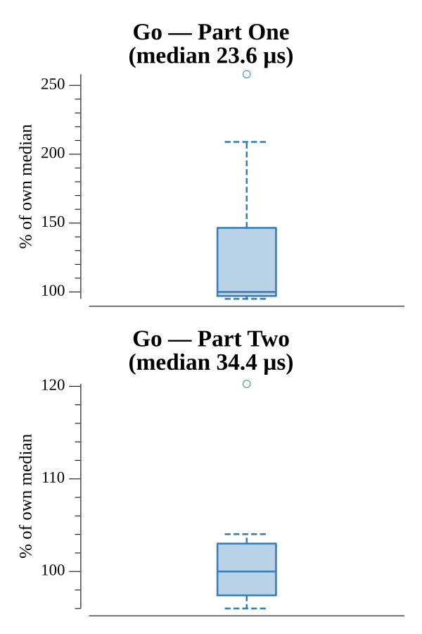

# [Day 4: Secure Container](https://adventofcode.com/2019/day/4)

<!-- These are helper text to make formatting the yearly readme consistent and easier...

[Day 4: Secure Container][rm4]
[Go][go4]
[Python][py4]

[rm4]: 04-secureContainer/README.md
[go4]: 04-secureContainer/go
[py4]: 04-secureContainer/py

-->

## Notes

Rather than scanning the full ~530,000-password range, the solution enumerates only non-decreasing 6-digit sequences by nesting digit loops — roughly 3,003 candidates in total. Each candidate is checked directly against the puzzle constraints without ever constructing a string.

Part One accepts any candidate that contains at least one pair of adjacent identical digits.

Part Two tightens the rule: at least one run of exactly two identical digits must exist. A longer run (three or more of the same digit) does not count on its own, but if the same password also has a separate run of exactly two, it still qualifies. Both parts work entirely from the parsed input range with no preprocessing.

## Go

```text
Solving (Go)…
1.0:  PASS            25.120µs
2.0:  PASS            32.989µs
```

## Run Times



## 2019 Run Times


