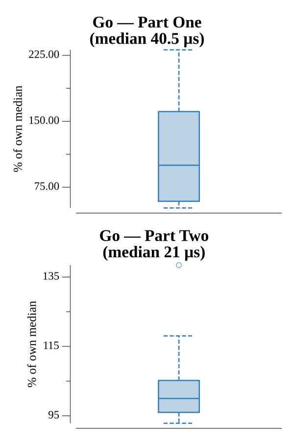

# [Day 5: Sunny with a Chance of Asteroids](https://adventofcode.com/2019/day/5)

<!-- These are helper text to make formatting the yearly readme consistent and easier...

[Day 5: Sunny with a Chance of Asteroids][rm5]
[Go][go5]
[Python][py5]

[rm5]: 05-sunnyWithAChanceOfAsteroids/README.md
[go5]: 05-sunnyWithAChanceOfAsteroids/go
[py5]: 05-sunnyWithAChanceOfAsteroids/py

-->

## Notes

Day 5 extends the Day 2 Intcode computer with parameter modes (position vs immediate, decoded from the hundreds, thousands, and ten-thousands digits of each instruction word) and four new opcodes: 3 (read input), 4 (write output), 5 (jump-if-true), 6 (jump-if-false), 7 (less-than), and 8 (equals). Part One runs with input=1 and returns the last output (diagnostic code). Part Two runs with input=5 using the jump and compare opcodes, also returning the single output.

## Go

```text
Solving (Go)…
1.0:  PASS            40.702µs
2.0:  PASS            21.609µs
```

## Run Times


