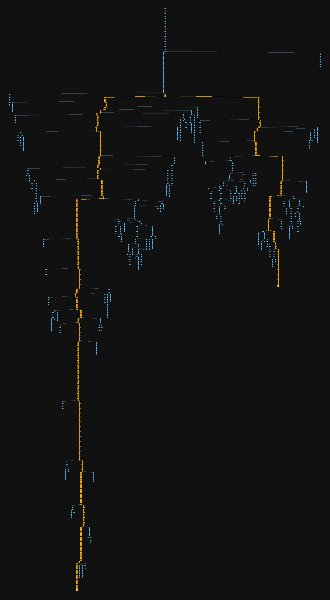
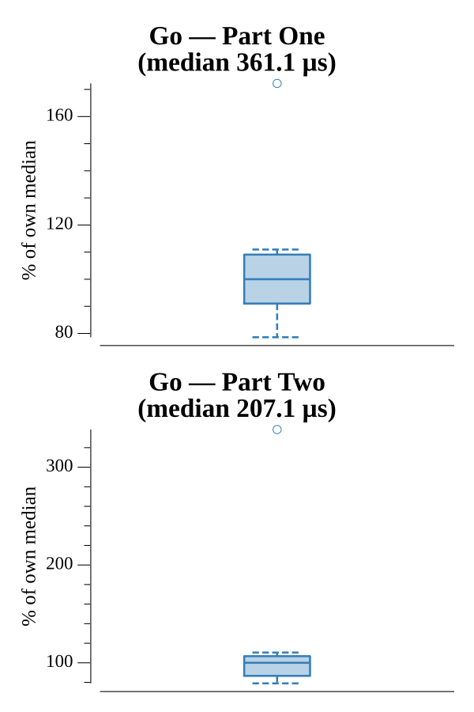

# [Day 6: Universal Orbit Map](https://adventofcode.com/2019/day/6)

<!-- These are helper text to make formatting the yearly readme consistent and easier...

[Day 6: Universal Orbit Map][rm6]
[Go][go6]

[rm6]: 06-universalOrbitMap/README.md
[go6]: 06-universalOrbitMap/go

-->

## Notes

Part One: parse each `A)B` line into a child→parent map, then compute each node's depth with memoized recursion. Summing all depths gives the total orbit count in O(n).

Part Two: walk YOU's ancestor chain and record the distance from YOU's parent to each ancestor. Then walk SAN's ancestor chain upward; the first node that appears in YOU's distance map is the lowest common ancestor. The answer is the sum of the two distances to that ancestor — O(depth) LCA without a BFS.

## Go

```text
Solving (Go)…
1.0:  PASS           410.774µs
2.0:  PASS           221.126µs
```

## Visualization

The orbit tree has ~1295 nodes across 352 depth levels. The layered diagram places each depth level in a horizontal band, nodes as dots, edges as lines. The YOU→SAN transfer path is drawn in Okabe-Ito orange (#E69F00), with YOU and SAN marked in yellow; all other nodes are blue (#56B4E9) on a dark background. Brightness contrast between the highlighted path and the rest of the tree is sufficient to read in grayscale.



## Run Times


