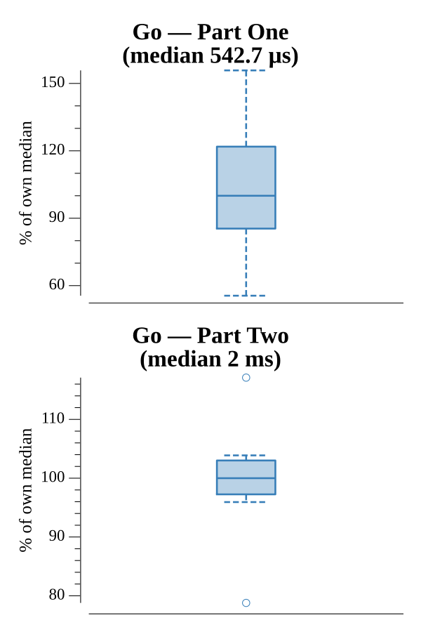

# [Day 7: Amplification Circuit](https://adventofcode.com/2019/day/7)

<!-- These are helper text to make formatting the yearly readme consistent and easier...

[Day 7: Amplification Circuit][rm7]
[Go][go7]
[Python][py7]

[rm7]: 07-amplificationCircuit/README.md
[go7]: 07-amplificationCircuit/go
[py7]: 07-amplificationCircuit/py

-->

## Notes

Part One: enumerate all 5! permutations of phases [0–4], run five Intcode amplifiers in series (each to completion), threading one amp's output as the next amp's input, and return the maximum final signal.

Part Two: phases [5–9], amplifiers run in a feedback loop — implemented with Go goroutines and buffered channels. Each amp goroutine blocks reading from its input channel and writes to the next; amp E's output channel feeds back into amp A's input channel. After all amps halt, the last value written to amp E's output channel is the answer.

## Go

```text
Solving (Go)…
1.0:  PASS             0.893ms
2.0:  PASS             2.522ms
```

## Run Times


