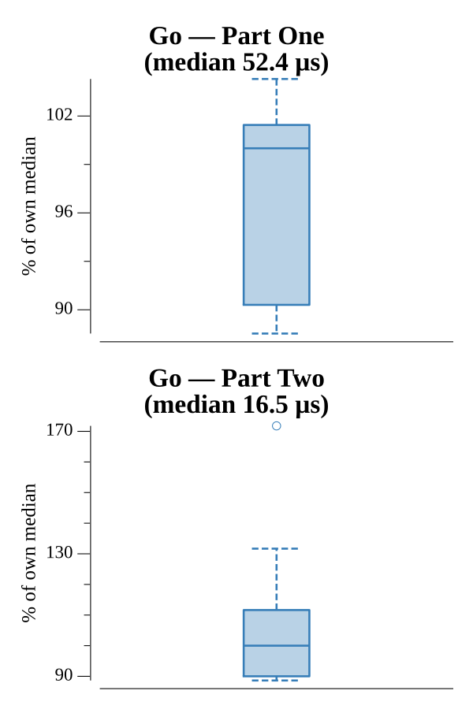

# [Day 8: Space Image Format](https://adventofcode.com/2019/day/8)

<!-- These are helper text to make formatting the yearly readme consistent and easier...

[Day 8: Space Image Format][rm8]
[Go][go8]
[Python][py8]

[rm8]: 08-spaceImageFormat/README.md
[go8]: 08-spaceImageFormat/go
[py8]: 08-spaceImageFormat/py

-->

## Notes

Part One: single O(n) pass over input bytes, chunk into 25×6 layers of 150 bytes, count digit frequencies per layer, return ones×twos for the layer with fewest zeros.

Part Two: composite layers front-to-back (first non-transparent pixel wins), render 25×6 grid with █/░ characters — spells ZLBJF.

## Go

```text
Solving (Go)…
1.0:  PASS            53.699µs
2.0:  PASS            19.477µs
```

## Visualization

Each pixel cell is upscaled to 20×20 display pixels, producing a 500×120 PNG. White pixels (value 1) render as bright white (#FFFFFF); black pixels (value 0) render as near-black (#111111). The dark background makes the letters trivially legible and the image is grayscale-readable without any reliance on color.


## Run Times


