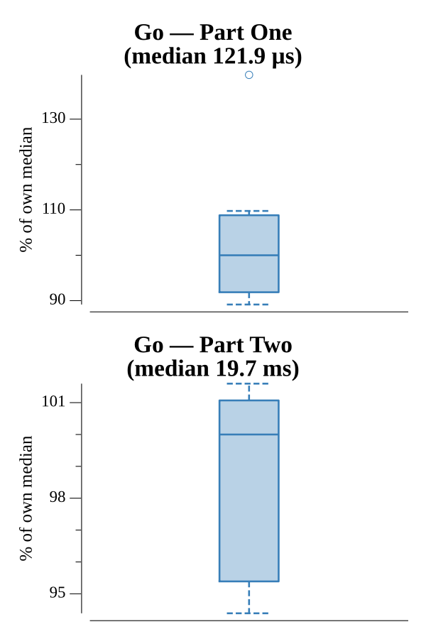

# [Day 9: Sensor Boost](https://adventofcode.com/2019/day/9)

<!-- These are helper text to make formatting the yearly readme consistent and easier...

[Day 9: Sensor Boost][rm9]
[Go][go9]
[Python][py9]

[rm9]: 09-sensorBoost/README.md
[go9]: 09-sensorBoost/go
[py9]: 09-sensorBoost/py

-->

## Notes

Day 9 completes the Intcode spec: adds relative mode (parameter mode 2, using a `relativeBase` register), opcode 9 (adjusts `relativeBase`), and unbounded memory (implemented via `map[int]int`). Part One runs with input=1 (diagnostic mode), Part Two with input=2 (sensor boost mode); both return the single output value.

## Go

```text
Solving (Go)…
1.0:  PASS             0.118ms
2.0:  PASS            20.276ms
```

## Run Times


