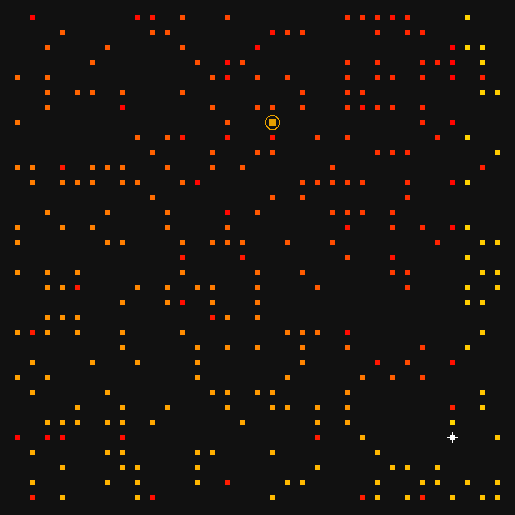
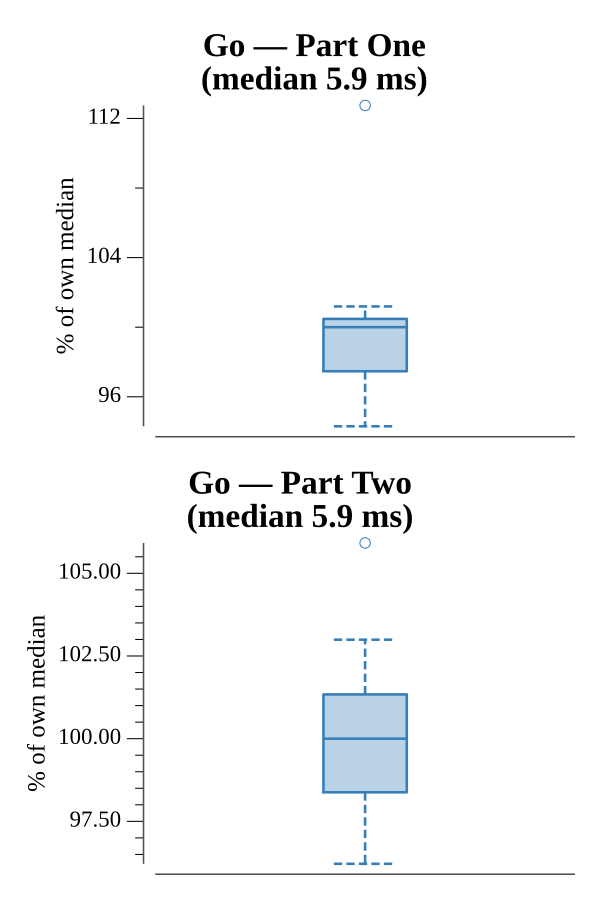

# [Day 10: Monitoring Station](https://adventofcode.com/2019/day/10)

<!-- These are helper text to make formatting the yearly readme consistent and easier...

[Day 10: Monitoring Station][rm10]
[Go][go10]
[Python][py10]

[rm10]: 10-monitoringStation/README.md
[go10]: 10-monitoringStation/go
[py10]: 10-monitoringStation/py

-->

## Notes

Part One: for each asteroid, compute normalized direction vectors to every other asteroid by dividing `(dx, dy)` by their GCD. Count unique directions — this equals the number of asteroids directly visible from that position. Return the maximum count over all asteroids.

Part Two: from the best monitoring station, group asteroids by their normalized direction, sort each bucket by Manhattan distance (nearest first), and sort direction groups by clockwise angle from straight up using `atan2(dx, -dy)`. Sweep in rotation order, vaporizing the nearest asteroid in each direction per pass, cycling until the 200th asteroid is vaporized. Return `x*100 + y`.

## Go

```text
Solving (Go)…
1.0:  PASS             6.043ms
2.0:  PASS             6.219ms
```

## Visualization

The asteroid field rendered as a 284×284 PNG (8px per grid cell, 10px margin). All asteroids are colored by vaporization order using a yellow-to-red gradient (early = bright yellow, late = deep red). The best monitoring station is marked with a white crosshair. The 200th vaporized asteroid is highlighted in orange (#E69F00) with a ring around it.



## Run Times


