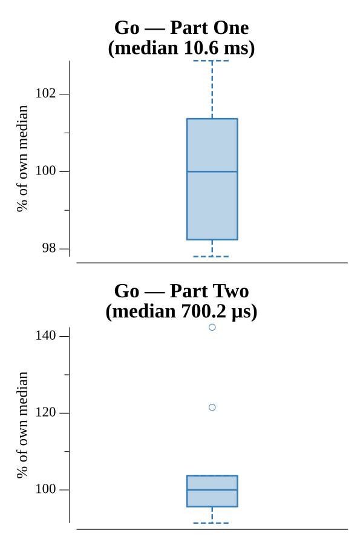

# [Day 11: Space Police](https://adventofcode.com/2019/day/11)

<!-- These are helper text to make formatting the yearly readme consistent and easier...

[Day 11: Space Police][rm11]
[Go][go11]
[Python][py11]

[rm11]: 11-spacePolice/README.md
[go11]: 11-spacePolice/go
[py11]: 11-spacePolice/py

-->

## Notes

The Intcode computer runs in a goroutine, communicating with the robot loop via a pair of channels. On each step the robot sends the current panel's color as input, reads two output values — paint color then turn direction — paints the panel, turns (0=left, 1=right), and steps forward. Y increases upward in the robot's coordinate system.

Part One counts how many distinct panels the robot paints at least once, starting on a black panel (1951 panels).

Part Two starts the robot on a white panel and renders the painted hull. The white panels spell the registration identifier **HKJBAHCR**. Part Two completes in under 1 ms because the hull is small; Part One takes ~11 ms (the same robot run on a larger traversal).

## Go

```text
Solving (Go)…
1.0:  PASS            11.342ms
      1951
2.0:  PASS             0.717ms
      ░█░░█░█░░█░░░██░███░░░██░░█░░█░░██░░███░░░░
      ░█░░█░█░█░░░░░█░█░░█░█░░█░█░░█░█░░█░█░░█░░░
      ░████░██░░░░░░█░███░░█░░█░████░█░░░░█░░█░░░
      ░█░░█░█░█░░░░░█░█░░█░████░█░░█░█░░░░███░░░░
      ░█░░█░█░█░░█░░█░█░░█░█░░█░█░░█░█░░█░█░█░░░░
      ░█░░█░█░░█░░██░░███░░█░░█░█░░█░░██░░█░░█░░░
```

## Visualization

Animated GIF of the robot painting the Part Two registration identifier (556×112, 126 frames, ~33 fps). White panels on a dark background; the robot is shown in orange (Okabe-Ito) at each step. Letters HKJBAHCR emerge as the robot sweeps the hull.


## Run Times


