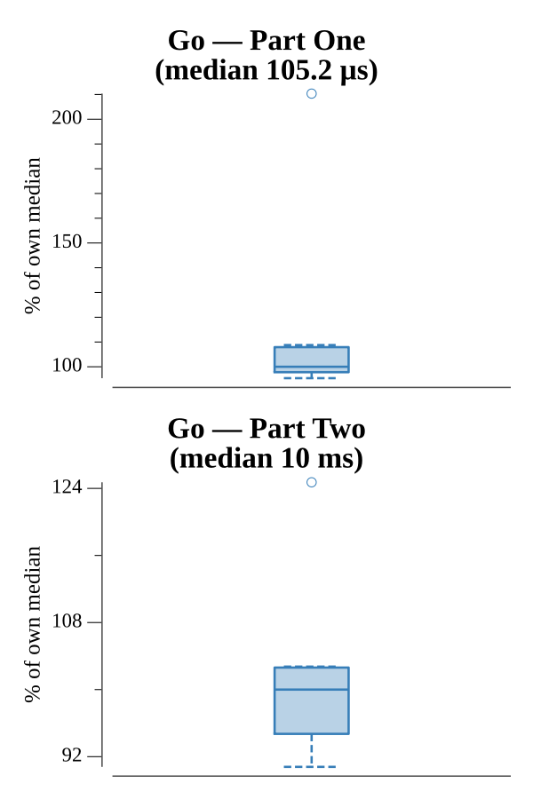

# [Day 12: The N-Body Problem](https://adventofcode.com/2019/day/12)

<!-- These are helper text to make formatting the yearly readme consistent and easier...

[Day 12: The N-Body Problem][rm12]
[Go][go12]

[rm12]: 12-theN-BodyProblem/README.md
[go12]: 12-theN-BodyProblem/go/exercise.go

-->

## Notes

The simulation applies gravity pairwise: for each pair of moons, adjust each axis velocity ±1 by the sign of the position difference, then apply velocities. Total energy is the sum over all moons of (sum of absolute positions) × (sum of absolute velocities).

Part One simulates for 1000 steps (the step count is configurable via a "Steps: N" header in the input) and returns the total system energy.

Part Two exploits axis independence — the x, y, and z axes evolve completely independently of one another. Each axis's 1D state (positions + velocities for all moons on that axis) is simulated until it repeats its initial state, giving cycle lengths cx, cy, cz. The answer is lcm(cx, cy, cz). The real-input cycle is ~315 trillion steps, so the full simulation cannot be run directly; the axis decomposition reduces it to three tractable searches. All arithmetic uses int64.

## Go

```text
Solving (Go)…
1.0:  PASS             0.108ms
2.0:  PASS             8.256ms
```

## Run Times


