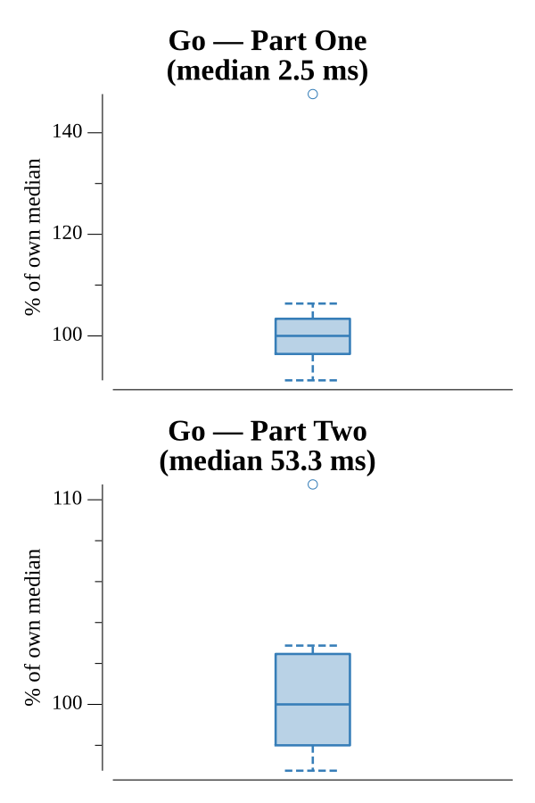

# [Day 13: Care Package](https://adventofcode.com/2019/day/13)

<!-- These are helper text to make formatting the yearly readme consistent and easier...

[Day 13: Care Package][rm13]
[Go][go13]
[Python][py13]

[rm13]: 13-carePackage/README.md
[go13]: 13-carePackage/go
[py13]: 13-carePackage/py

-->

## Notes

The Intcode computer drives an arcade cabinet that renders a breakout-style game on a tile grid. Each output triple encodes (x, y, tile_id): 0=empty, 1=wall, 2=block, 3=horizontal paddle, 4=ball. The score is emitted as the third value when x=−1 and y=0.

Part One runs the program in read-only mode (no quarters inserted) and counts how many tiles with ID 2 (block) appear on screen after the program halts — 193 blocks.

Part Two sets memory address 0 to 2 (free play) and runs a simple ball-tracking AI: on each input request the joystick feeds `sign(ball_x − paddle_x)`, which keeps the paddle centered under the ball. The program runs to completion once all blocks are destroyed, and the final score is 10547.

## Go

```text
────────────────────────────────────────
─      2019 Day 13: Care Package       ─
────────────────────────────────────────

Solving (Go)…
1.0:  PASS             1.901ms
2.0:  PASS            39.547ms
```

## Run Times


