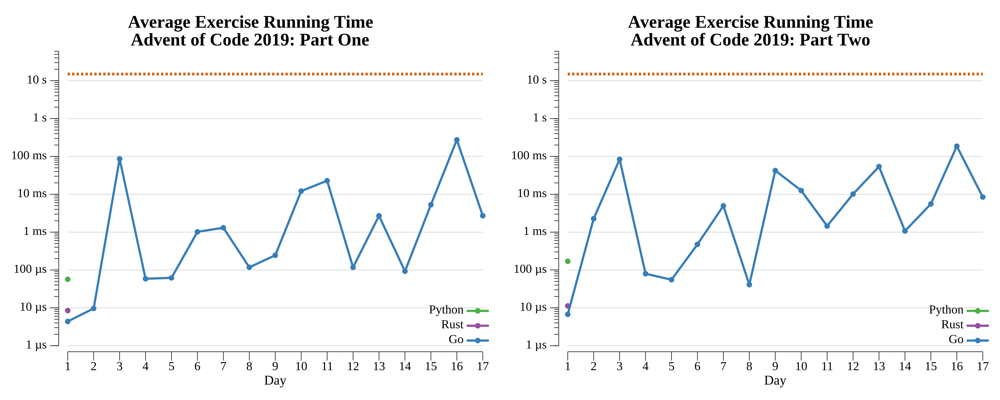

# [Day 14: Space Stoichiometry](https://adventofcode.com/2019/day/14)

<!-- These are helper text to make formatting the yearly readme consistent and easier...

[Day 14: Space Stoichiometry][rm14]
[Go][go14]
[Python][py14]

[rm14]: 14-spaceStoichiometry/README.md
[go14]: 14-spaceStoichiometry/go
[py14]: 14-spaceStoichiometry/py

-->

## Go

```text
< section intentionally left blank >
```

## Python

```text
< section intentionally left blank >
```

## 2019 Run Times


