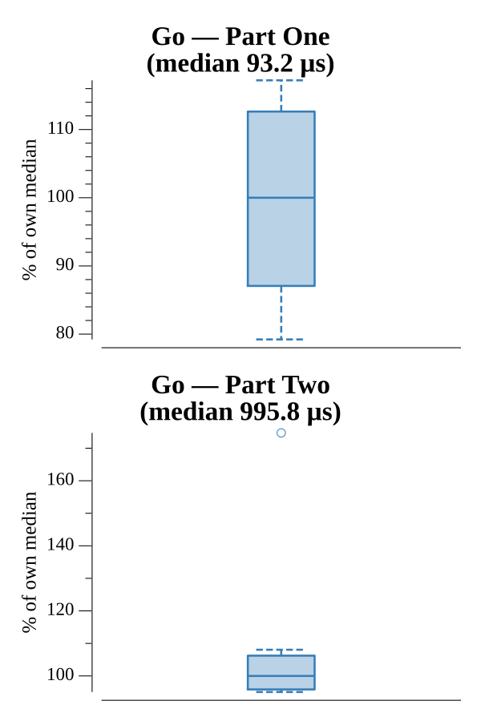

# [Day 14: Space Stoichiometry](https://adventofcode.com/2019/day/14)

<!-- These are helper text to make formatting the yearly readme consistent and easier...

[Day 14: Space Stoichiometry][rm14]
[Go][go14]
[Python][py14]

[rm14]: 14-spaceStoichiometry/README.md
[go14]: 14-spaceStoichiometry/go
[py14]: 14-spaceStoichiometry/py

-->

## Notes

The input encodes a directed acyclic reaction graph: each chemical has exactly one recipe producing some quantity of it from one or more inputs. The goal is to find the minimum ORE required to produce a target amount of FUEL.

Part One walks the DAG backwards from FUEL, accumulating demand for each chemical. When a chemical is needed, the recipe is applied using ceiling division so no partial batches are run; any excess produced is tracked as surplus and consumed before requesting more ORE. Processing chemicals in topological order (leaves first) ensures every surplus is fully accounted for before its parent is resolved. The result is 843220 ORE for 1 FUEL.

Part Two asks how much FUEL can be produced from exactly 1 trillion ORE. Because the ORE cost is monotonically non-decreasing in FUEL quantity, a binary search over the FUEL amount uses Part One's cost function as the predicate. The search converges quickly to 2169535 FUEL.

## Go

```text
────────────────────────────────────────
─   2019 Day 14: Space Stoichiometry   ─
────────────────────────────────────────

Testing (Go)…
1.0:  PASS             7.822µs

Solving (Go)…
1.0:  PASS             0.072ms
2.0:  PASS             1.155ms
```

## Run Times


