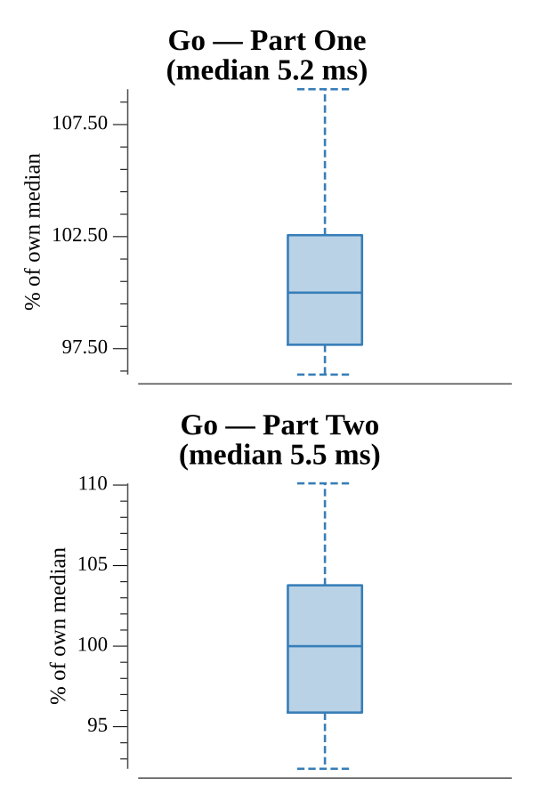

# [Day 15: Oxygen System](https://adventofcode.com/2019/day/15)

<!-- These are helper text to make formatting the yearly readme consistent and easier...

[Day 15: Oxygen System][rm15]
[Go][go15]

[rm15]: 15-oxygenSystem/README.md
[go15]: 15-oxygenSystem/go

-->

## Notes

The input is an Intcode program controlling a repair droid that can move in four directions. The droid's responses indicate a wall, an open tile, or the oxygen system location, but the full map must be discovered through exploration.

Part One uses Intcode-driven DFS with backtracking to map the entire maze. The droid explores every reachable cell, recording walls and open space, and notes the position of the oxygen system. Once the full map is known, BFS from (0,0) to the oxygen system finds the shortest path. The answer is 238 steps.

Part Two performs BFS flood-fill from the oxygen system position across the complete known map. Each BFS level represents one minute of oxygen spreading to adjacent open cells; the maximum depth when all reachable cells are filled equals the minutes required. The answer is 392 minutes.

## Go

```text
────────────────────────────────────────
─      2019 Day 15: Oxygen System      ─
────────────────────────────────────────

Solving (Go)…
1.0:  PASS             5.706ms
2.0:  PASS             5.607ms
```

## Run Times


