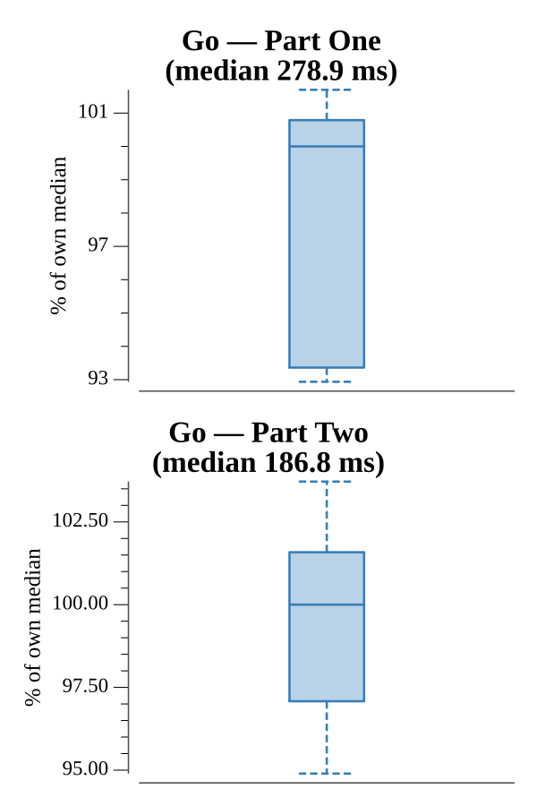

# [Day 16: Flawed Frequency Transmission](https://adventofcode.com/2019/day/16)

<!-- These are helper text to make formatting the yearly readme consistent and easier...

[Day 16: Flawed Frequency Transmission][rm16]
[Go][go16]

[rm16]: 16-flawedFrequencyTransmission/README.md
[go16]: 16-flawedFrequencyTransmission/go

-->

## Notes

The input is a string of ~650 digits that must be transformed through 100 phases of the Flawed Frequency Transmission (FFT) algorithm.

Part One applies the base pattern [0, 1, 0, −1] with each element repeated (position + 1) times and left-shifted by one, then computes each output digit as the absolute value of the dot product of the input and the pattern, mod 10. With ~650 digits and 100 phases this is an O(n²) per-phase calculation, feasible in well under a second.

Part Two repeats the input 10 000 times to form a ~6.5M-digit signal and reads 8 digits at a position given by the first 7 digits of the original input. That offset always falls in the second half of the signal, where the repeating pattern simplifies to all 1s. Each phase therefore reduces to a right-to-left suffix sum mod 10, an O(n) operation per phase instead of O(n²), making 100 phases over 6.5M digits practical.

## Go

```text
────────────────────────────────────────
─    2019 Day 16: Flawed Frequency     ─
─             Transmission             ─
────────────────────────────────────────

Testing (Go)…
1.0:  PASS             0.672ms
2.0:  PASS             5.638ms

Solving (Go)…
1.0:  PASS           280.094ms
2.0:  PASS           189.189ms
```

## Run Times


