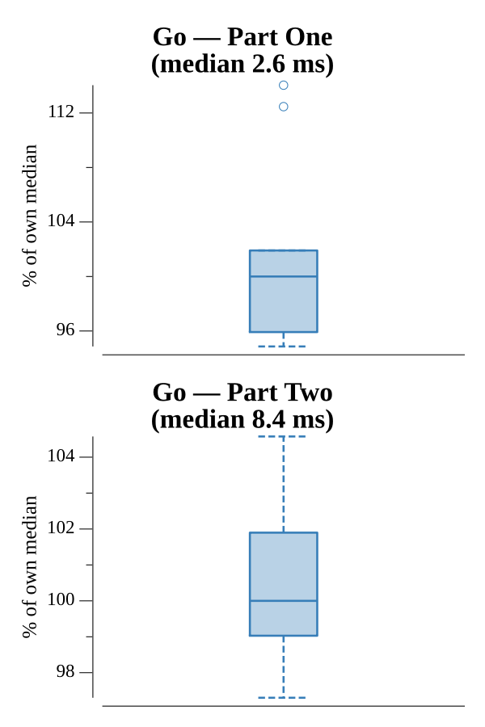

# [Day 17: Set and Forget](https://adventofcode.com/2019/day/17)

<!-- These are helper text to make formatting the yearly readme consistent and easier...

[Day 17: Set and Forget][rm17]
[Go][go17]

[rm17]: 17-setAndForget/README.md
[go17]: 17-setAndForget/go

-->

## Notes

The input is an Intcode program that controls a camera-equipped robot on a scaffolding grid.

Part One runs the Intcode program and collects its ASCII output to decode the scaffold map. Each cell is either scaffold (`#`) or open space (`.`). Intersections are scaffold cells where all four orthogonal neighbors are also scaffold. The alignment parameter for each intersection is x * y; summing these gives the answer.

Part Two walks the full scaffold path greedily to build a single movement token sequence (e.g. `R,8,L,10,…`), then compresses it into three named functions A, B, and C, each at most 20 characters long, via a nested prefix search. The main movement routine lists which functions to call in order. All routines are ASCII-encoded and fed to the Intcode VM after setting `prog[0] = 2`. The final non-ASCII value the VM outputs is the amount of dust collected.

## Go

```text
────────────────────────────────────────
─     2019 Day 17: Set and Forget      ─
────────────────────────────────────────

Solving (Go)…
1.0:  PASS             2.792ms
2.0:  PASS             8.701ms
```

## Run Times


